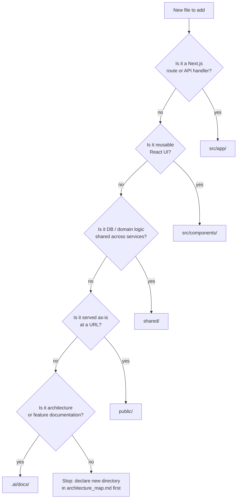

# Directory Hygiene — Single-Purpose Folders

**Status:** Active policy. All agents and contributors must follow this when creating, moving, or reviewing files.

Every directory in Project Nexus has **one declared purpose**. A folder must contain **only** files that directly serve that purpose. Do not use folders as catch-alls for unrelated assets, experiments, duplicates, or “might need later” clutter.

This policy complements [architecture_map.md](./architecture_map.md), which lists each path’s allowed and forbidden contents.

---

## Core rule

> **If a file does not match the directory’s declared purpose, it does not belong there — even if “it still works.”**

Before adding or keeping a file in a folder, ask:

1. What is this directory **for**? (see `architecture_map.md`)
2. Does this file **only** exist because of that purpose?
3. Would a new developer know **why** this file is here without guessing?

If any answer is “no,” place the file elsewhere or delete it.

---

## What counts as “garbage” in a directory

| Violation | Example | Correct placement |
|-----------|---------|-------------------|
| **Wrong layer** | Mongoose model in `src/components/` | `shared/models/` |
| **Wrong runtime** | React component in `shared/` | `src/components/` |
| **Static asset in app tree** | `logo.svg` copied into `src/app/` | `public/` (runtime) or `.ai/docs/assets/` (design reference) |
| **Design reference in runtime** | Figma export PNG in `public/` | `.ai/docs/assets/` |
| **Duplicate copies** | Same `logo.svg` in `public/`, `src/app/`, and `.ai/docs/assets/` | One canonical runtime copy in `public/`; design sources stay under `.ai/docs/assets/` |
| **API logic in UI folder** | DB query inside `src/components/ui/` | `src/app/api/` or `shared/domains/` |
| **Misc dump folder** | `src/utils/`, `src/misc/`, `temp/` with mixed unrelated files | Split by domain into declared directories or remove |
| **Docs inside source** | Feature spec `.md` in `src/app/` | `.ai/docs/features/` |
| **Secrets / env** | `.env.local` committed under `src/` | Root `.env*.local` (gitignored) only |

---

## Allowed vs forbidden (by top-level path)

### `src/app/`

**For:** Next.js routes, root layout, route-local colocated files, global app CSS.

| Allowed | Forbidden |
|---------|-----------|
| `layout.tsx`, `page.tsx`, `loading.tsx`, `error.tsx` | Reusable components used across many routes |
| `globals.css` (imported once from root layout) | Mongoose models, domain business logic |
| `globals.css` only (no favicons — those live in `public/icons/`) | `favicon.ico`, `icon.*`, duplicate logos |
| `api/**/route.ts` | Standalone scripts, test fixtures, random images |
| Route-colocated client modules (e.g. `[...puckPath]/client.tsx`) | Documentation markdown |

### `src/components/`

**For:** Reusable React UI bound to the design system.

| Allowed | Forbidden |
|---------|-----------|
| `ui/`, `puck/`, `background/` subfolders by concern | API routes, DB access, `.env` files |
| One block per file when a Puck block grows large | Unrelated “helper” components with no shared UI role |

### `shared/`

**For:** Code shared across web, workers, and containers (no React, no Next.js).

| Allowed | Forbidden |
|---------|-----------|
| `models/`, `lib/`, `domains/` | `.tsx` files, CSS, images, frontend hooks |

### `public/`

**For:** Static files served at URL root (`/file.ext`). Use **dedicated subfolders** — never dump all assets at `public/` root.

| Subfolder | Purpose |
|-----------|---------|
| `public/icons/` | Favicons and app icons (`favicon.ico`, `apple-icon.png`) |
| `public/brand/` | Brand marks (`logo.svg`) referenced by UI components |

| Allowed | Forbidden |
|---------|-----------|
| Files in `icons/`, `brand/`, and future declared subfolders | `favicon.ico` or `logo.svg` at `public/` root |
| Fonts, downloadable assets in named subfolders | Compiled `.next` output, secrets, create-next-app boilerplate (`next.svg`, `vercel.svg`) |
| Paths imported via `src/lib/assets.ts` | Hardcoded `/logo.svg` strings scattered in components |

**Icon resolution:** `src/app/layout.tsx` sets `metadata.icons` from `SITE_ICONS` in `src/lib/assets.ts` — no `favicon.ico` in `src/app/`.

### `.ai/docs/`

**For:** Living architecture truth, specs, roadmap — **not** application runtime.

| Allowed | Forbidden |
|---------|-----------|
| `architecture_map.md`, `roadmap.md`, `features/*.md` | `.ts`, `.tsx`, `.js` that the app imports |
| `assets/` for design-time references (background engine sources, Figma exports) | Duplicates of `public/` assets unless explicitly documented as source-of-truth |

### `.ai/assets/`

**For:** Symlink or mirror of design-time media from `.ai/docs/assets/` — never imported by production bundles.

---

## Colocation rules (when files live *next to* a route)

Next.js allows colocating files inside route folders. Colocated files must still **serve that route only**:

- `[...puckPath]/client.tsx` — OK: only used by the Puck catch-all route.
- `pages/NewPageForm.tsx` — OK: only used by `/pages`.
- A generic `Button.tsx` inside `src/app/news/` — **Not OK**: move to `src/components/ui/`.

---

## Agent workflow (mandatory)

1. **Read** [architecture_map.md](./architecture_map.md) and this file before creating a directory or adding a file.
2. **Declare** new directories in `architecture_map.md` immediately (purpose, allowed, forbidden).
3. **Reject** placing a file in the nearest convenient folder; use the correct layer.
4. **On refactor:** if misplaced files are found, move them to the canonical path in the same change (or open a focused cleanup task).
5. **No new generic buckets** such as `misc/`, `stuff/`, `old/`, `backup/` unless given an explicit, documented purpose.

---

## Quick decision tree

---

## Examples from Project Nexus

| File | Correct location | Why |
|------|------------------|-----|
| `InfiniteGrid.tsx` | `src/components/background/` | Reusable client UI, not a route |
| `config.tsx` (Puck blocks) | `src/components/puck/` | Editor registry, not a page |
| `Page.ts` (Mongoose) | `shared/models/` | Shared persistence schema |
| `db.ts` | `shared/lib/` | Shared connection helper |
| `favicon.ico` | `public/icons/favicon.ico` | Browser tab icon; referenced via `metadata.icons` |
| `logo.svg` (header/background) | `public/brand/logo.svg` | Runtime brand asset; path from `src/lib/assets.ts` |
| `assets.ts` (path constants) | `src/lib/assets.ts` | Single source of truth for static URLs |
| `background/app.js` (vanilla prototype) | `.ai/docs/assets/background/` | Design reference only |
| `globals.css` | `src/app/globals.css` | App-wide styles, imported from root layout |
| `figma_ui_integration.md` | `.ai/docs/features/` | Feature specification |

---

*Agents: violating directory hygiene creates spaghetti structure. Fix placement in the same PR as the feature, or document an explicit exception in `architecture_map.md`.*
