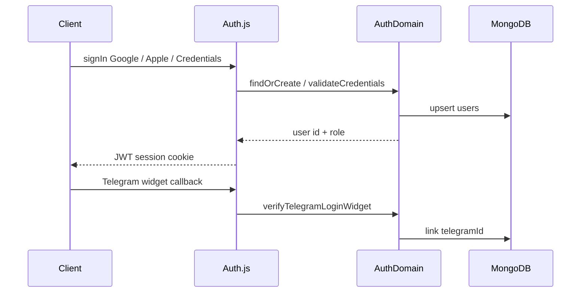

# Authentication & User Profiles

**Status:** `[x] Completed` — core auth and profile flows implemented; task list remains placeholder until Phase 5.

**Figma references:** [figma_ui_integration.md](./figma_ui_integration.md) — Auth `57:17`, Profile `59:47`

---

## Overview

Cross-platform authentication merges Google OAuth2, Apple Sign In, Telegram Login Widget, **Telegram Mini App** (`/telegram`), and login/password credentials into a single MongoDB `users` document. Auth.js (NextAuth v5) issues JWT sessions; all mutations flow through `shared/domains/AuthDomain.ts`.

**Telegram surfaces:** Browser users link via the Login Widget; Telegram app users open the Mini App at `/telegram` (auto-login or onboarding). See [telegram_mini_app_and_bot.md](./telegram_mini_app_and_bot.md).

**Credentials model:** Students sign in with a unique **`login`** handle (3–32 chars, lowercase alphanumeric plus `.`, `-`, `_`). **Email is optional** at signup — used only as a linked contact/OAuth merge field, not for credentials sign-in.

---

## Route map

| Route | Type | Purpose |
|-------|------|---------|
| `/login` | Page | Login/password sign-in + OAuth row |
| `/signup` | Page | Student registration — login, optional linked email (Figma `57:17`) |
| `/profile` | Page | Read-only profile dashboard (Figma `59:47`) |
| `/profile/settings` | Page | Editable user info |
| `/telegram` | Page | Telegram Mini App entry (auto-login / onboarding) |
| `/api/auth/[...nextauth]` | API | Auth.js handler |
| `/api/auth/register` | API | POST credentials signup (JSON API) |
| `/api/auth/login` | API | POST form login fallback (redirect) — primary UI uses client `signIn` |
| `/api/auth/signup` | API | POST form register fallback — primary UI uses `/api/auth/register` + client `signIn` |
| `/api/auth/telegram` | API | POST Telegram widget verification |
| `/api/auth/telegram/mini-app` | API | POST Mini App `initData` → bridge or onboarding |
| `/api/auth/telegram/mini-app/register` | API | POST Mini App onboarding registration |
| `/api/telegram/webhook` | API | Bot webhook (`/start` → Open Nexus button) |
| `/api/profile` | API | PATCH profile fields |
| `/api/profile/telegram` | API | DELETE unlink Telegram (session required) |

---

## Data flow



---

## User model extensions

| Field | Type | Notes |
|-------|------|-------|
| `login` | `string \| null` | Unique credentials handle; sparse unique index |
| `email` | `string \| null` | Optional linked email; sparse unique index; OAuth merge |
| `emailVerified` | `Date \| null` | Set on OAuth verify |
| `passwordHash` | `string \| null` | bcrypt; never exposed |
| `appleId` | `string \| null` | Apple `sub` |
| `studentTitle` | `Starosta \| Deputy \| Neither \| null` | Registration chips |
| `accentFamily` | `blue \| red \| yellow \| green \| purple` | Default `blue` |
| `accentShade` | `soft \| medium \| strong` | Default `medium` |
| `lastTelegramSyncAt` | `Date \| null` | Profile sync card |

RBAC `role` (`Admin` / `StudentCouncil` / `Student`) is server-assigned only.

---

## Environment variables

```bash
NEXTAUTH_SECRET=          # Required in production
NEXTAUTH_URL=http://localhost:8080
GOOGLE_CLIENT_ID=
GOOGLE_CLIENT_SECRET=
AUTH_APPLE_ID=            # Apple Services ID
AUTH_APPLE_SECRET=        # Apple client secret JWT
TELEGRAM_BOT_TOKEN=       # BotFather token for widget + Mini App initData + bot API
NEXT_PUBLIC_TELEGRAM_BOT_USERNAME=
TELEGRAM_WEBHOOK_SECRET=  # Optional webhook header validation
ADMIN_SEED_LOGIN=         # Admin credentials seed (required with ADMIN_SEED_PASSWORD)
ADMIN_SEED_EMAIL=         # Optional linked email for seeded admin
ADMIN_SEED_PASSWORD=
```

`docker-compose.yml` loads secrets from `.env.local`. Do **not** hardcode `NEXTAUTH_URL` in Compose — set it in `.env.local` so it matches how you open the app (scheme, host, and port in the browser address bar).

**Phone / LAN testing:** If you open the app as `http://192.168.x.x:8080` on your phone, `NEXTAUTH_URL` must use that same LAN IP — **not** `http://localhost:8080`. On a phone, `localhost` is the phone itself, so auth redirects and session cookies target the wrong host and sign-in appears to fail.

**Default admin (dev):** Set `ADMIN_SEED_LOGIN` + `ADMIN_SEED_PASSWORD` in `.env.local`. Sign in on `/login` with the **login handle** (e.g. `admin`), not email. `ADMIN_SEED_EMAIL` is optional. On first load, `seedAdminUser()` creates the admin or **backfills `login`** on a legacy email-only seed document and resets its password from env.

---

### Signed in but `/profile` sends me back to `/login`

1. **`localhost` redirect on phone (most common):** Auth redirects are built from `NEXTAUTH_URL` via `resolvePublicOrigin()` (`src/lib/publicOrigin.ts`). If the dev machine still has `NEXTAUTH_URL=http://localhost:8080` while you browse from an iPhone at `http://YOUR_LAN_IP:8080`, post-login redirects send the phone to **its own** `localhost`, not your PC. Set `NEXTAUTH_URL` to the LAN URL you actually open (e.g. `http://192.168.50.10:8080`), then `docker compose up -d --force-recreate web`. Find your LAN IP: `hostname -I | awk '{print $1}'`.
2. **URL mismatch:** `NEXTAUTH_URL` must match the browser address bar (host **and** port). Docker maps host **8080** → container **3000**; use **8080** in both the URL you open and `NEXTAUTH_URL`.
3. **Next.js dev blocks LAN assets:** When `NEXTAUTH_URL` uses a LAN hostname, `next.config.ts` auto-adds it to `allowedDevOrigins` so dev JS/CSS load from the phone.
4. **Credentials forms:** `/login` and `/signup` submit via client-side Auth.js (`signIn({ redirect: false })` and `/api/auth/register`). Invalid credentials show inline without a full page reload. Legacy `/api/auth/login` and `/api/auth/signup` form POST routes remain as no-JS fallbacks.
5. **Stale session:** Clear site cookies for the host, sign in again.

### React hydration warnings on `/profile`

1. **Dark Reader / similar extensions** inject `data-darkreader-*` attributes and `--darkreader-*` CSS variables on SVG and `` nodes after paint. These are not Nexus SSR bugs. The header logo, theme toggle icons, and profile accent scope use `suppressHydrationWarning` and CSS-class filters where needed.
2. **Real SSR theme mismatch** (cookie `system` vs toggle knob): `HeaderSessionBridge` resolves dark/light via `resolveStoredThemeIsDark()` (`src/lib/resolveStoredThemeIsDark.ts`) using the theme cookie plus `Sec-CH-Prefers-Color-Scheme`. Middleware sends `Accept-CH` so first visits without a cookie align with OS preference.
3. **Theme toggle first paint:** `ThemeToggleLink` defers knob position until after mount (same pattern as `ThemeToggle`) so SSR and hydration agree before applying the server-resolved value.

### `window.ethereum.selectedAddress` TypeError

Not emitted by Nexus application code. Brave and some wallet extensions assign to `window.ethereum` before the provider is injected. Root layout runs a minimal `beforeInteractive` shim (`nexus-wallet-shim`) so `window.ethereum` exists as a stub when extensions race ahead of injection.


## AuthDomain API

| Method | Purpose |
|--------|---------|
| `registerWithCredentials` | Signup with bcrypt hash |
| `validateCredentials` | Login handle + password |
| `findOrCreateFromGoogle` | OAuth merge by `googleId` or email |
| `findOrCreateFromApple` | OAuth merge by `appleId` or email |
| `verifyTelegramLoginWidget` | HMAC verify + link Telegram identity |
| `authenticateTelegramMiniApp` | Mini App initData → returning user or onboarding |
| `registerFromTelegramMiniApp` | First-time Mini App registration + `telegramId` link |
| `unlinkTelegram` | Remove `telegramId` when password/OAuth remains |
| `updateProfile` | Settings page PATCH |
| `changePassword` | Current + new password |
| `toPublicUser` | Strip `passwordHash` for API/session |

---

## Input Validation

All authentication and profile settings forms are validated using **Zod** schemas.

### Validation Rules

- **Login:** Trimmed, lowercased, 3–32 characters; `[a-z0-9._-]` only.
- **Linked email (signup):** Optional; trimmed, lowercased, valid email format, max 254 characters when provided.
- **Password:** Minimum 8 characters, max 128 characters.
- **Specialty / Group:** Optional, trimmed, max 120 characters when present. Empty strings are transformed to `null`.
- **Student Title:** Must be one of `Starosta | Deputy | Neither` (defaults to `Neither`).
- **Display Name:** Required, trimmed, 1–100 characters.
- **Accent Family:** Must be one of `blue | red | yellow | green | purple`.
- **Accent Shade:** Must be one of `soft | medium | strong`.
- **Password Change:** If `newPassword` is set, `currentPassword` is required and `newPassword` must be at least 8 characters.

### Shared Schemas & Utilities

Validation logic is centralized in the `shared/validation/` folder:

- `authSchemas.ts` — `loginSchema`, `signupSchema`, `registerSchema`
- `profileSchemas.ts` — `profileUpdateSchema`, `clientProfileSettingsSchema`
- `authErrorCodes.ts` — Maps stable error codes (e.g. `credentials`, `login_exists`, `email_exists`, `validation`) to localized, user-friendly messages.
- `formatValidationErrors.ts` — Formats Zod errors into a flat key-value map of field errors.

### Unified UI Feedback

We use two reusable design system components for displaying errors and success messages:

1. **`FormAlert`** (`src/components/ui/form-alert.tsx`) — Displays form-level alerts (errors, success, or info) with matching theme colors.
2. **`FormField`** (`src/components/ui/form-field.tsx`) — Wraps input controls with labels and inline field-level errors, automatically setting `aria-invalid` and `aria-describedby` for accessibility.

---

## Middleware

Protects `/profile/*` and `/admin/*`. Unauthenticated users redirect to `/login?callbackUrl=…`.

Dev bypass: when `NEXTAUTH_SECRET` is unset, API write guards allow all requests (editor works without auth setup).

---

## Acceptance criteria

- [x] Sign up with login/password + optional linked email + specialty/group/student title
- [x] Sign in via Google, Apple, Telegram widget, Telegram Mini App, or credentials (inline errors, no full-page reload on bad password)
- [x] Profile settings can unlink Telegram when another sign-in method exists
- [x] Identities merge into one `users` document
- [x] `/profile` read-only dashboard with live user data
- [x] `/profile/settings` saves editable fields
- [x] GlobalHeader shows avatar + admin nav from session
- [x] Protected API routes use `auth()` session check (legacy bearer fallback for Puck editor)

**Deferred:** Task list and council activity on profile use Figma placeholder content until Phase 5 Task engine.
