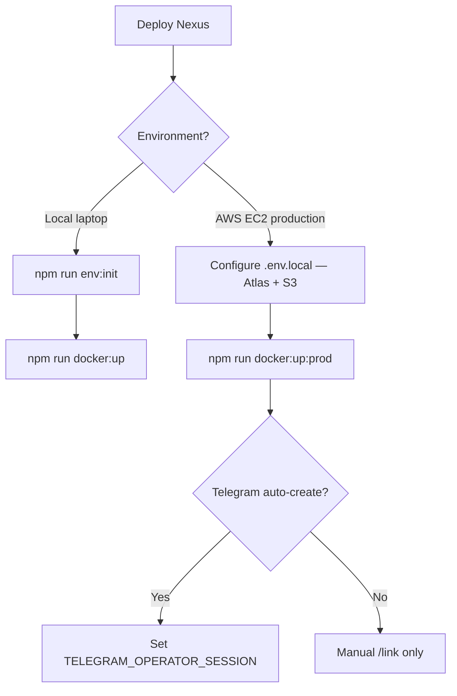

# Hosting & deployment — AWS EC2 + MongoDB Atlas + S3

**Status:** `[~] In Progress` — manual `NEXUS_HOSTING_MODE=vps` deployment is complete; GitHub Actions OIDC, ECR, CDK, SSM rollout, health verification, and rollback are being added.

**Related:** [scheduled_events.md](./scheduled_events.md), [media_storage.md](./media_storage.md), [telegram_project_workspaces.md](./telegram_project_workspaces.md), [production_readiness.md](../production_readiness.md)

---

## Overview

Nexus targets **always-on AWS EC2** (or local Docker dev) with:

| Component | Production | Local dev |
|-----------|------------|-----------|
| **App** | Docker `production` target or `node server.js` | Docker `dev` target (hot-reload) |
| **MongoDB** | MongoDB Atlas (or other cloud MongoDB) | Bundled Compose `db` **or** Atlas |
| **Media** | **Amazon S3** (required in production) | Local disk (`public/uploads/`) |
| **Scheduler** | In-process `setInterval` on EC2 | Same (or optional HTTP cron) |
| **Telegram worker** | `telegram-worker-prod` on EC2 | `telegram-worker` in dev stack |

```bash
NEXUS_HOSTING_MODE=vps    # only supported mode (default when unset)
```

Boot validation **requires** `MEDIA_STORAGE_DRIVER=s3` when `NODE_ENV=production`.

### CI/CD target architecture

Nexus keeps the existing always-on EC2 runtime while making build and promotion
immutable:

```text
feature branch ──PR──► dev ──PR──► main
                         │           │
                         ▼           ▼
                    staging env  production env
                         │           │
GitHub OIDC ──► ECR SHA images ──► SSM deploy ──► EC2 Docker Compose
                                                   │
                                                   ├─ Secrets Manager → .env.local
                                                   ├─ web image
                                                   ├─ telegram-worker image
                                                   └─ Caddy HTTPS proxy
```

| Concern | Contract |
|---------|----------|
| Release branch | `main` is the only production release branch; `dev` is integration/staging |
| AWS authentication | GitHub OIDC exchanges a job token for short-lived AWS credentials; no IAM access key is stored in GitHub |
| Artifacts | Separate web and worker ECR images tagged with the immutable Git commit SHA; EC2 resolves and runs their `sha256` digests |
| Runtime secrets | One Secrets Manager secret per environment; only the EC2 instance role can read it |
| Deployment transport | GitHub may invoke the tagged EC2 instance through SSM Run Command; port 22 stays closed |
| Public configuration | `NEXT_PUBLIC_*` values are environment-scoped GitHub variables supplied at image build time; they are never secret |
| Rollout | EC2 takes an exclusive deployment lock, pulls the requested SHA, recreates containers, checks `/api/health`, and restores the previous image references on failure |
| TLS | Caddy terminates HTTPS from `NEXTAUTH_URL`; DNS must resolve to the environment Elastic IP |
| Scheduler ownership | Exactly one web container per environment runs in-process scheduled jobs; blue/green overlap is intentionally avoided |

The GitHub deployment role can push images and invoke the deployment SSM
document, but **cannot read application secrets**. The EC2 role can pull only
the environment repositories, read only the environment runtime secret, use
only the environment media bucket, and communicate with SSM.

---

## Environment files

Full guide: **[env_and_secrets.md](../env_and_secrets.md)** (solo dev, dotenvx, scripts, commit rules).

| File | Purpose |
|------|---------|
| [`.env.example`](../../.env.example) | Committed template — `npm run env:init` |
| `.env.local` | Runtime secrets (gitignored) |
| `.env.staging` | Team shared env, encrypted with dotenvx (optional, committed) |
| `.env.keys` | dotenvx decryption key (gitignored — team vault) |

```bash
npm run env:init              # solo: .env.example → .env.local
npm run env:pull-team         # team: decrypt .env.staging → .env.local
```

---

## Local development

**Bundled MongoDB (fastest):**

```bash
npm run env:init
npm run docker:up
```

**Atlas / remote MongoDB:**

```bash
npm run env:init
# set MONGODB_URI in .env.local
npm run docker:up:external
```

**Node without Docker:**

```bash
npm run env:init
# set MONGODB_URI=mongodb://localhost:27017/nexus if needed
npm run dev
```

---

## Production on AWS EC2

### 1. Provision

- **EC2** instance (Docker installed) for `web-prod` + `telegram-worker-prod`
- **MongoDB Atlas** cluster — add EC2 public IP to Network Access
- **S3 bucket** for media — public `GetObject`, EC2 IAM role for write/delete
- No CloudFront — local/institutional audiences load media from S3 HTTPS URLs

### 2. Configure

Copy [`.env.example`](../../.env.example) to `.env.local` on the server (or use team `.env.staging` via `npm run env:pull-team`). Set:

- `MONGODB_URI`, `NEXTAUTH_SECRET`, `NEXTAUTH_URL`
- `MEDIA_STORAGE_DRIVER=s3`, `S3_MEDIA_BUCKET`, `S3_MEDIA_REGION`
- `TELEGRAM_*`, `ADMIN_SEED_*` as needed

```bash
npm run auth:check-env
```

### 3. Deploy with Docker

```bash
npm run docker:up:prod
```

Uses [`docker-compose.yml`](../../docker-compose.yml) with Compose **profiles** (`dev`, `prod`, `bundled-db`). Every stack includes **web + telegram-worker**.

**Single container alternative:**

```bash
docker build --target production -t nexus-web .
docker run --env-file .env.local -p 3000:3000 nexus-web
```

### 4. Verify

- Open `NEXTAUTH_URL` in browser
- `GET /api/admin/hosting-config` (Admin) — check `healthy`, no errors
- Upload media — confirm S3 URLs in MongoDB / Puck

---

## Automated GitHub → AWS deployment

### Prerequisites

Install and authenticate both CLIs before the one-time bootstrap:

```bash
gh auth login
gh auth status

aws --version
aws sts get-caller-identity
```

Use an AWS administrator identity only for the initial CDK bootstrap. Routine
deployments use GitHub OIDC and do not use that administrator identity.

### 1. Choose the OIDC subject format

The default [`cdk.json`](../../cdk.json) uses the repository-name subject prefix:

```text
repo:Loggy-4ya/system-for-local-organization
```

Repositories created before 2026-07-15 normally use this format. Newer
repositories, or repositories opted into immutable OIDC claims, use owner and
repository IDs. Read the active mode in GitHub's OIDC settings before deploy.
The immutable prefix can be derived with:

```bash
gh api repos/Loggy-4ya/system-for-local-organization \
  --jq '"repo:\(.owner.login)@\(.owner.id)/\(.name)@\(.id)"'
```

Set that result as `githubSubjectPrefix` in `cdk.json` before deploying the IAM
roles. The stack appends `:environment:staging` or
`:environment:production`. A mismatch causes a safe `Not authorized to perform
sts:AssumeRoleWithWebIdentity` failure.

### 2. Bootstrap and deploy infrastructure

```bash
export AWS_PROFILE=ide-agent   # or your IAM Identity Center admin profile
export AWS_REGION=eu-central-1

npm ci
npm run infra:synth

npx cdk bootstrap aws://AWS_ACCOUNT_ID/eu-central-1
npm run infra:deploy:identity
npm run infra:deploy:staging
# Deploy production only when ready for the extra monthly cost:
# npm run infra:deploy:production
```

Deploy only the environments that should incur cost. Each environment owns an
EC2 instance and Elastic IP, two ECR repositories, a public-read media bucket,
a private deployment bucket, one Secrets Manager secret, a custom SSM document,
and separate IAM roles. `NexusGithubIdentity` is shared and deployed once per
AWS account. Nexus does **not** use CloudFront; browsers load media from the
virtual-hosted S3 HTTPS URL.

CDK outputs provide deployment coordinates and the media origin:

| CloudFormation output | Configuration destination |
|-----------------------|---------------------------|
| `GithubDeployRoleArn` | `AWS_ROLE_ARN` |
| `WebRepositoryUri` | `WEB_REPOSITORY_URI` |
| `WorkerRepositoryUri` | `WORKER_REPOSITORY_URI` |
| `DeploymentBucketName` | `DEPLOYMENT_BUCKET` |
| `DeploymentDocumentName` | `DEPLOYMENT_DOCUMENT` |
| `InstanceId` | `INSTANCE_ID` |
| Deployment region | `AWS_REGION` |
| Public HTTPS origin | `DEPLOY_URL` |
| `MediaPublicBaseUrl` | Optional Secrets Manager `S3_MEDIA_PUBLIC_BASE_URL` (S3 virtual-hosted URL) |

### 3. Configure encrypted runtime credentials

Secrets Manager is the production source of truth. Create a gitignored local
working file such as `.env.production.local` from [`.env.example`](../../.env.example),
replace placeholders, then upload it without shell interpolation:

```bash
aws secretsmanager put-secret-value \
  --secret-id nexus/production/runtime-env \
  --secret-string file://.env.production.local \
  --region eu-central-1
```

The payload must include:

- Atlas `MONGODB_URI`
- strong `NEXTAUTH_SECRET`
- public HTTPS `NEXTAUTH_URL`
- `MEDIA_STORAGE_DRIVER=s3`
- stack-output `S3_MEDIA_BUCKET`, `S3_MEDIA_REGION`, and optionally
  `S3_MEDIA_PUBLIC_BASE_URL` (same as `MediaPublicBaseUrl`)
- OAuth and Telegram values used by that environment

The media bucket allows public `s3:GetObject` so uploaded page media and avatars
remain readable without CloudFront. Uploads still use the EC2 instance role.
`S3_MEDIA_PUBLIC_BASE_URL` is optional — when omitted, Nexus builds
virtual-hosted S3 HTTPS URLs automatically.

Do not include `AWS_ACCESS_KEY_ID` or `AWS_SECRET_ACCESS_KEY`; the EC2 instance
role supplies AWS authorization. Delete the temporary plaintext working file
after upload. Secrets Manager encrypts the stored value and audits reads in
CloudTrail.

Repeat with `nexus/staging/runtime-env` for staging. Staging and production must
use different session secrets, OAuth clients where practical, Telegram bots,
Atlas databases/users, and S3 buckets.

### 4. DNS, Atlas, and HTTPS

1. Read `ElasticIpAddress` from the environment stack output.
2. Point the environment DNS `A` record to that address.
3. Allowlist the same stable Elastic IP in MongoDB Atlas Network Access.
4. Set `NEXTAUTH_URL` to the exact HTTPS origin.
5. Allow inbound TCP 80/443; CDK intentionally creates no SSH rule.

Caddy obtains and renews the public certificate after DNS resolves. SSM is the
only administrative transport.

### 5. Configure GitHub Environments

After `gh auth login`, AWS CLI authentication, and stack deployment:

```bash
npm run deploy:configure-github -- \
  staging https://staging.example.com staging_bot_username

npm run deploy:configure-github -- \
  production https://nexus.example.com production_bot_username
```

The script:

- creates/updates `staging` and `production`;
- restricts staging to `dev` and production to `main`;
- copies only non-secret CDK outputs into GitHub Environment variables;
- enables required CI checks, pull requests, linear history, and force-push /
  deletion protection when each branch exists;
- never uploads AWS keys, dotenvx keys, or runtime secrets.

Then open **GitHub repository → Settings → Environments → production**:

1. Add at least one **Required reviewer**.
2. Keep **Prevent self-review** enabled.
3. Confirm the only deployment branch rule is `main`.

Environment reviewer availability depends on the GitHub plan for private
repositories. If required reviewers are unavailable, keep production dispatch
disabled and require reviewed `dev` → `main` pull requests through branch
protection.

### 6. Create the production branch safely

Do this only when `dev` is clean, committed, pushed, and intentionally selected
as the first release:

```bash
git status --short
git switch dev
git pull --ff-only
git switch -c main
git push -u origin main
```

Never create `main` from an uncommitted working tree. After creation, rerun the
production GitHub configuration command so branch protection is applied.

### 7. Release and rollback behavior

1. Pull requests into `dev` and `main` run CI.
2. A successful push CI run builds web and worker images tagged with the full
   Git SHA; EC2 resolves those immutable tags and persists digest-qualified image
   references.
3. GitHub uploads the non-secret deployment bundle to the private deployment
   bucket.
4. The environment OIDC role invokes the custom SSM document.
5. EC2 reads its runtime secret, takes an exclusive deployment lock, starts the
   requested images, and waits for `/api/health`.
6. Any failure restores the previous compose file, Caddy config, runtime env,
   and image references.

`production` deployment starts only after its GitHub Environment protection
rules pass. Rerunning the same SHA reuses immutable ECR images.

All third-party GitHub Actions are pinned to reviewed commit SHAs. The worker
image installs production dependencies only and runs as a non-root user. Media
is served from public-read S3 (no CloudFront).

---

## Media storage (S3)

| `MEDIA_STORAGE_DRIVER` | Environment |
|------------------------|-------------|
| `local` | Local dev only |
| `s3` | **Required in production** |

Details: [media_storage.md](./media_storage.md)

---

## Background jobs

**Default on EC2:** in-process scheduler:

```bash
SCHEDULED_EVENTS_TICK_INTERVAL_SECONDS=15
MEDIA_ORPHAN_CLEANUP_INTERVAL_HOURS=24
```

**Alternative:** HTTP cron with `CRON_SECRET` or `NEXUS_CRON_SECRET` — see [scheduled_events.md](./scheduled_events.md).

---

## Telegram worker (EC2)

```bash
npm run docker:up:prod
```

Set `TELEGRAM_OPERATOR_SESSION`, `TELEGRAM_API_ID`, and `TELEGRAM_API_HASH` in `.env.local`. Without operator session: manual `/link` only — see [telegram_project_workspaces.md](./telegram_project_workspaces.md).

---

## Docker Compose reference

| Command | Profiles | Use |
|---------|----------|-----|
| `npm run docker:up` | `dev`, `bundled-db` | Local dev — web + worker + MongoDB |
| `npm run docker:up:external` | `dev` | Local dev — web + worker + Atlas |
| `npm run docker:up:prod` | `prod` | EC2 — web-prod + telegram-worker-prod |

Unified [`Dockerfile`](../../Dockerfile) targets: `dev`, `production`, `worker`.

---

## Boot validation

On server start, `bootstrapNexusHosting()` validates env. Fatal in production when `MEDIA_STORAGE_DRIVER` is not `s3`.

Admin diagnostics: `GET /api/admin/hosting-config`

---

## Tests

```bash
npm run infra:synth
npm run test:run -- nexus-deployment-infrastructure
npm run test:run -- nexus-hosting-logic
npm run test:run -- media-storage
```

---

## Decision guide


