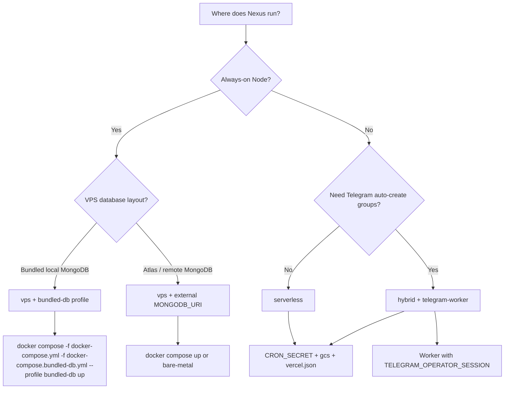

# Hosting & deployment modes

**Status:** `[x] Completed` — `NEXUS_HOSTING_MODE`, env profile templates, boot validation, admin diagnostics API.

**Related:** [scheduled_events.md](./scheduled_events.md), [media_storage.md](./media_storage.md), [telegram_project_workspaces.md](./telegram_project_workspaces.md), [production_readiness.md](../production_readiness.md)

---

## Overview

Nexus runs on **one codebase** with three deployment profiles:

| Mode | Typical target | Scheduler | Media storage | Telegram auto-create |
|------|----------------|-----------|---------------|-------------------|
| `vps` | Docker, VPS, bare metal | In-process `setInterval` | `local` or `gcs` | Optional on same host |
| `serverless` | Vercel, Lambda + Atlas | HTTP cron (`vercel.json`) | **`gcs` required** in prod | Manual `/link` only |
| `hybrid` | Vercel web + worker | HTTP cron on web | **`gcs` required** in prod | Separate `telegram-worker` |

Set explicitly:

```bash
NEXUS_HOSTING_MODE=vps          # or serverless | hybrid
```

When unset:

- `VERCEL=1` → infers `serverless`
- Otherwise → `vps`

---

## Env files — which one to use?

Nexus ships **five** env example files. They are not interchangeable copies of the same content — each has a different job:

| File | Role | You copy it to… |
|------|------|-----------------|
| **`.env.example`** | **Master reference** — every variable Nexus understands, with comments explaining background jobs, OAuth, Telegram, media, etc. | `.env.local` when you want to build config from scratch or look up a variable |
| **`.env.vps.example`** | **Bundled MongoDB** — app + `db` container for local Docker dev | `.env.local` + bundled-db compose override (see below) |
| **`.env.vps-external-db.example`** | **External MongoDB** — app on VPS/Docker, DB on Atlas or another host | `.env.local` + `docker compose up` |
| **`.env.vercel.example`** | **Ready-made serverless profile** — vars to paste into Vercel project settings | Vercel dashboard (not a file in the repo) |
| **`.env.hybrid.example`** | **Ready-made hybrid profile** — web vars for Vercel + notes for the worker | Vercel dashboard + worker host env |

### What to do with `.env.example`

**Do not deploy with it as-is.** It is documentation you keep in git — like a catalogue.

Typical workflows:

1. **Local dev with bundled MongoDB** — fastest for laptop development:
   ```bash
   cp .env.vps.example .env.local
   docker compose -f docker-compose.yml -f docker-compose.bundled-db.yml --profile bundled-db up
   ```

2. **VPS / production with external MongoDB** — app on your server, database elsewhere (Atlas, dedicated DB VPS):
   ```bash
   cp .env.vps-external-db.example .env.local
   # set MONGODB_URI to your Atlas or remote connection string
   docker compose up
   ```

3. **Local dev without Docker** — MongoDB must be reachable at `MONGODB_URI`:
   ```bash
   cp .env.vps.example .env.local   # or localhost:27017 if mongo runs on host
   # OR
   cp .env.example .env.local       # full reference
   npm run dev
   ```

4. **Need a variable not in the profile template?** — open `.env.example`, find the variable and its comment, add that line to your `.env.local` (or Vercel env).

5. **Production on Vercel** — use `.env.vercel.example` or `.env.hybrid.example` as a checklist; set each line in Vercel → Settings → Environment Variables. You do **not** upload `.env.local` to Vercel.

**Rule of thumb:** profile `.example` files = fast start for a hosting mode; `.env.example` = complete dictionary when something is missing or unclear.

Next.js still loads secrets from **`.env.local`** at runtime (gitignored). `.env.example` is only the committed template — standard convention in most repos.

---

## How to use each profile

### VPS — two database layouts

Nexus on a VPS always uses `NEXUS_HOSTING_MODE=vps` (in-process scheduler, no `CRON_SECRET` required). The difference is **where MongoDB runs**:

| Layout | When | Env template | Docker command |
|--------|------|--------------|----------------|
| **Bundled MongoDB** | Local dev — app + DB in Docker on one machine | `.env.vps.example` | `docker compose -f docker-compose.yml -f docker-compose.bundled-db.yml --profile bundled-db up` |
| **External MongoDB** | Production VPS, or dev against Atlas | `.env.vps-external-db.example` | `docker compose up` |

#### Bundled MongoDB (local dev)

```bash
cp .env.vps.example .env.local
# Fill in NEXTAUTH_SECRET, admin seed password
docker compose -f docker-compose.yml -f docker-compose.bundled-db.yml --profile bundled-db up
```

- `MONGODB_URI=mongodb://db:27017/nexus` — hostname `db` is the Compose service name
- `MEDIA_STORAGE_DRIVER=local` — uploads on the Docker volume

#### External MongoDB (Atlas / dedicated DB host)

```bash
cp .env.vps-external-db.example .env.local
# Set MONGODB_URI to your Atlas or remote connection string
docker compose up
```

- No `db` container — only the `web` service starts
- Point `MONGODB_URI` at MongoDB Atlas, a database VPS, or any reachable host
- On Atlas: add your server IP to **Network Access**; use a database user with read/write on the `nexus` database

**Bare-metal production** (no Compose):

```bash
cp .env.vps-external-db.example .env.local
npm run build && npm run start
# Or: docker build -t nexus-web . && docker run --env-file .env.local -p 3000:3000 nexus-web
```

`docker-compose.yml` sets `NEXUS_HOSTING_MODE=vps` and the tick interval; your `.env.local` supplies `MONGODB_URI`.

---

### Vercel (serverless)

For the web app on Vercel with MongoDB Atlas and GCS media.

1. Open [`.env.vercel.example`](../../.env.vercel.example).
2. In Vercel → **Project → Settings → Environment Variables**, add each variable (Production, and Preview if needed).
3. Deploy — [vercel.json](../../vercel.json) registers crons that call:
   - every minute → `/api/admin/jobs/process-scheduled-events`
   - daily 03:00 UTC → `/api/admin/jobs/media-orphan-cleanup`
4. Vercel sends `Authorization: Bearer <CRON_SECRET>` automatically.

**Do not set** `SCHEDULED_EVENTS_TICK_INTERVAL_SECONDS` or `MEDIA_ORPHAN_CLEANUP_INTERVAL_HOURS` on Vercel — boot validation rejects them in serverless mode.

Telegram project groups on Vercel-only: use manual `/link` (Bot API). For auto-create, forum topics, and member sync, run **telegram-worker** with operator env (hybrid profile) — see [telegram_project_workspaces.md](./telegram_project_workspaces.md).

---

### Hybrid (Vercel web + telegram-worker)

When you need serverless web **and** automatic Telegram group creation via MTProto.

**Web app (Vercel):**

1. Copy vars from [`.env.hybrid.example`](../../.env.hybrid.example) into Vercel env (same rules as serverless: `CRON_SECRET`, `MEDIA_STORAGE_DRIVER=gcs`, no in-process tick).
2. Set `NEXUS_HOSTING_MODE=hybrid`.

**Worker (separate always-on host — Phase 4b, planned):**

- Run a `telegram-worker` service (not on Vercel) with:
  - `TELEGRAM_OPERATOR_SESSION` — GramJS/Telethon session export
  - Same `MONGODB_URI` and `TELEGRAM_BOT_TOKEN` as the web app
- Until the worker ships, hybrid behaves like serverless for scheduling; Telegram groups still use manual `/link`.

---

## Quick start templates (summary)

| File | Use when |
|------|----------|
| [`.env.vps.example`](../../.env.vps.example) | Local Docker dev with bundled MongoDB |
| [`.env.vps-external-db.example`](../../.env.vps-external-db.example) | VPS / Docker with Atlas or remote MongoDB |
| [`.env.vercel.example`](../../.env.vercel.example) | Vercel project env vars |
| [`.env.hybrid.example`](../../.env.hybrid.example) | Vercel + separate MTProto worker |
| [`.env.example`](../../.env.example) | Full variable reference — not a deploy profile |

---

## Environment variables by mode

### All modes

| Variable | Required |
|----------|----------|
| `MONGODB_URI` | Yes |
| `NEXTAUTH_SECRET` | Yes |
| `NEXTAUTH_URL` | Yes (public HTTPS in production) |

### `vps`

| Variable | Notes |
|----------|-------|
| `SCHEDULED_EVENTS_TICK_INTERVAL_SECONDS=15` | In-process scheduler (recommended) |
| `MEDIA_ORPHAN_CLEANUP_INTERVAL_HOURS=24` | Optional in-process cleanup |
| `MEDIA_STORAGE_DRIVER=local` | OK with persistent volume |
| `CRON_SECRET` | Optional — only if using external crontab instead of in-process tick |

### `serverless`

| Variable | Notes |
|----------|-------|
| `CRON_SECRET` | **Required in production** — Vercel cron auth |
| `MEDIA_STORAGE_DRIVER=gcs` | **Required in production** |
| `SCHEDULED_EVENTS_TICK_INTERVAL_SECONDS` | **Must be unset** — boot error if set |
| `MEDIA_ORPHAN_CLEANUP_INTERVAL_HOURS` | **Must be unset** — use [vercel.json](../../vercel.json) cron |

### `hybrid`

Same rules as `serverless` on the **web app**. Additionally:

| Variable | Where |
|----------|-------|
| `TELEGRAM_OPERATOR_SESSION` | **telegram-worker** container only (not Vercel) |

---

## Boot validation

On Node server start (`src/instrumentation.ts`):

1. Resolves `NEXUS_HOSTING_MODE`
2. Clamps in-process scheduler intervals (forces `0` on serverless/hybrid)
3. Logs warnings (e.g. hybrid without operator session)
4. Logs errors (e.g. `local` media on Vercel prod)
5. **Aborts boot** when errors exist in `NODE_ENV=production`, or when `NEXUS_HOSTING_STRICT=true`

### Code map

| Module | Role |
|--------|------|
| `shared/constants/nexusHosting.ts` | Mode slugs |
| `shared/lib/nexusHostingLogic.ts` | Resolution + validation (pure) |
| `src/lib/nexusHostingBootstrap.ts` | Boot logging + cache |
| `src/lib/nexusJobsConfig.ts` | Scheduler intervals via policy |
| `src/instrumentation.ts` | Calls bootstrap on boot |

---

## HTTP cron (serverless / hybrid / external VPS)

[vercel.json](../../vercel.json):

| Schedule | Route |
|----------|-------|
| Every minute | `/api/admin/jobs/process-scheduled-events` |
| Daily 03:00 UTC | `/api/admin/jobs/media-orphan-cleanup` |

**telegram-worker** (optional, VPS/hybrid): `docker compose --profile telegram-worker up` or `npm run worker:telegram` — requires `TELEGRAM_OPERATOR_SESSION`, `TELEGRAM_API_ID`, `TELEGRAM_API_HASH`, `TELEGRAM_BOT_TOKEN`. Polls provisioning jobs and `operatorPendingAction` maintenance (enable forum, sync members, dismantle).

Auth: `Authorization: Bearer $CRON_SECRET` (Vercel injects automatically).

External VPS crontab alternative:

```bash
curl -H "Authorization: Bearer $NEXUS_CRON_SECRET" \
  "$NEXTAUTH_URL/api/admin/jobs/process-scheduled-events"
```

---

## Admin diagnostics

`GET /api/admin/hosting-config` (Admin session) returns:

- `mode`, `modeLabel`
- `policy` (effective scheduler/storage flags)
- `warnings`, `errors`
- `healthy` boolean

Use after deploy to confirm the running instance matches intent.

---

## Docker Compose

| Command | MongoDB | Use case |
|---------|---------|----------|
| `docker compose -f docker-compose.yml -f docker-compose.bundled-db.yml --profile bundled-db up` | Bundled `db` container | Local dev |
| `docker compose up` | External (`MONGODB_URI` in `.env.local`) | VPS prod, Atlas |

[docker-compose.yml](../../docker-compose.yml) sets `NEXUS_HOSTING_MODE=vps`. The `db` service uses profile `bundled-db` so it is opt-in.

---

## Tests

```bash
npm run test:nexus-hosting-logic
```

---

## Decision guide


