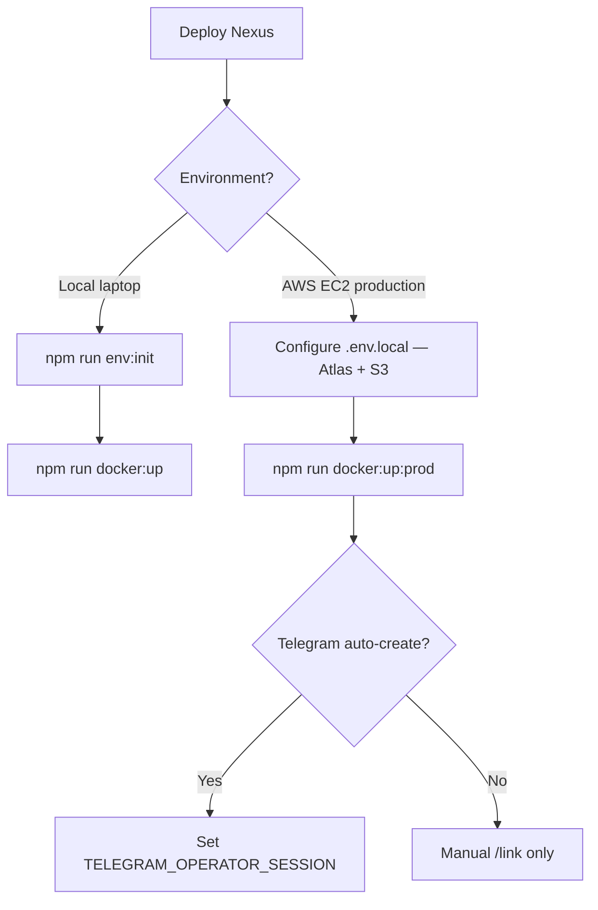

# Hosting & deployment — AWS EC2 + MongoDB Atlas + S3

**Status:** `[x] Completed` — `NEXUS_HOSTING_MODE=vps`, Docker multi-stage build, boot validation, admin diagnostics.

**Related:** [scheduled_events.md](./scheduled_events.md), [media_storage.md](./media_storage.md), [telegram_project_workspaces.md](./telegram_project_workspaces.md), [production_readiness.md](../production_readiness.md)

---

## Overview

Nexus targets **always-on AWS EC2** (or local Docker dev) with:

| Component | Production | Local dev |
|-----------|------------|-----------|
| **App** | Docker `production` target or `node server.js` | Docker `dev` target (hot-reload) |
| **MongoDB** | MongoDB Atlas (or other cloud MongoDB) | Bundled Compose `db` **or** Atlas |
| **Media** | **Amazon S3** (required in production) | Local disk (`public/uploads/`) |
| **Scheduler** | In-process `setInterval` on EC2 | Same (or optional HTTP cron) |
| **Telegram worker** | `telegram-worker-prod` on EC2 | `telegram-worker` in dev stack |

```bash
NEXUS_HOSTING_MODE=vps    # only supported mode (default when unset)
```

Boot validation **requires** `MEDIA_STORAGE_DRIVER=s3` when `NODE_ENV=production`.

---

## Environment files

Full guide: **[env_and_secrets.md](../env_and_secrets.md)** (solo dev, dotenvx, scripts, commit rules).

| File | Purpose |
|------|---------|
| [`.env.example`](../../.env.example) | Committed template — `npm run env:init` |
| `.env.local` | Runtime secrets (gitignored) |
| `.env.staging` | Team shared env, encrypted with dotenvx (optional, committed) |
| `.env.keys` | dotenvx decryption key (gitignored — team vault) |

```bash
npm run env:init              # solo: .env.example → .env.local
npm run env:pull-team         # team: decrypt .env.staging → .env.local
```

---

## Local development

**Bundled MongoDB (fastest):**

```bash
npm run env:init
npm run docker:up
```

**Atlas / remote MongoDB:**

```bash
npm run env:init
# set MONGODB_URI in .env.local
npm run docker:up:external
```

**Node without Docker:**

```bash
npm run env:init
# set MONGODB_URI=mongodb://localhost:27017/nexus if needed
npm run dev
```

---

## Production on AWS EC2

### 1. Provision

- **EC2** instance (Docker installed) for `web-prod` + `telegram-worker-prod`
- **MongoDB Atlas** cluster — add EC2 public IP to Network Access
- **S3 bucket** for media — IAM role on EC2 with `s3:PutObject`, `s3:DeleteObject`, `s3:ListBucket`
- Optional **CloudFront** → set `S3_MEDIA_PUBLIC_BASE_URL`

### 2. Configure

Copy [`.env.example`](../../.env.example) to `.env.local` on the server (or use team `.env.staging` via `npm run env:pull-team`). Set:

- `MONGODB_URI`, `NEXTAUTH_SECRET`, `NEXTAUTH_URL`
- `MEDIA_STORAGE_DRIVER=s3`, `S3_MEDIA_BUCKET`, `S3_MEDIA_REGION`
- `TELEGRAM_*`, `ADMIN_SEED_*` as needed

```bash
npm run auth:check-env
```

### 3. Deploy with Docker

```bash
npm run docker:up:prod
```

Uses [`docker-compose.yml`](../../docker-compose.yml) with Compose **profiles** (`dev`, `prod`, `bundled-db`). Every stack includes **web + telegram-worker**.

**Single container alternative:**

```bash
docker build --target production -t nexus-web .
docker run --env-file .env.local -p 3000:3000 nexus-web
```

### 4. Verify

- Open `NEXTAUTH_URL` in browser
- `GET /api/admin/hosting-config` (Admin) — check `healthy`, no errors
- Upload media — confirm S3 URLs in MongoDB / Puck

---

## Media storage (S3)

| `MEDIA_STORAGE_DRIVER` | Environment |
|------------------------|-------------|
| `local` | Local dev only |
| `s3` | **Required in production** |

Details: [media_storage.md](./media_storage.md)

---

## Background jobs

**Default on EC2:** in-process scheduler:

```bash
SCHEDULED_EVENTS_TICK_INTERVAL_SECONDS=15
MEDIA_ORPHAN_CLEANUP_INTERVAL_HOURS=24
```

**Alternative:** HTTP cron with `CRON_SECRET` or `NEXUS_CRON_SECRET` — see [scheduled_events.md](./scheduled_events.md).

---

## Telegram worker (EC2)

```bash
npm run docker:up:prod
```

Set `TELEGRAM_OPERATOR_SESSION`, `TELEGRAM_API_ID`, and `TELEGRAM_API_HASH` in `.env.local`. Without operator session: manual `/link` only — see [telegram_project_workspaces.md](./telegram_project_workspaces.md).

---

## Docker Compose reference

| Command | Profiles | Use |
|---------|----------|-----|
| `npm run docker:up` | `dev`, `bundled-db` | Local dev — web + worker + MongoDB |
| `npm run docker:up:external` | `dev` | Local dev — web + worker + Atlas |
| `npm run docker:up:prod` | `prod` | EC2 — web-prod + telegram-worker-prod |

Unified [`Dockerfile`](../../Dockerfile) targets: `dev`, `production`, `worker`.

---

## Boot validation

On server start, `bootstrapNexusHosting()` validates env. Fatal in production when `MEDIA_STORAGE_DRIVER` is not `s3`.

Admin diagnostics: `GET /api/admin/hosting-config`

---

## Tests

```bash
npm run test:run -- nexus-hosting-logic
npm run test:run -- media-storage
```

---

## Decision guide


