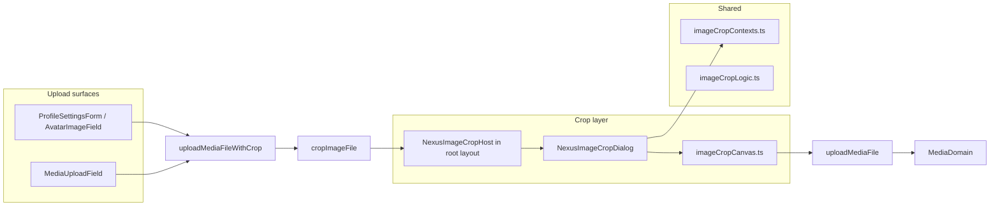

# Image Crop Editor — App-Wide Crop, Rotate & Preview Masks

**Status:** `[x] Completed` — `react-easy-crop` dialog mounted globally; wired to profile avatar and Puck media uploads.

## Goal

Before any image upload, users can **crop**, **rotate**, and **preview contextual masks** that mirror real Nexus surfaces (profile circle, directory thumbnail, page cover, Puck block ratios).

Videos and GIFs skip the crop step. Cancelled crops abort the upload without error. Users may
**Use original** to upload the picked file unchanged, or **Use cropped** after editing.

---

## Architecture



| Path | Role |
|------|------|
| `shared/constants/imageCropContexts.ts` | Preview mask definitions per upload purpose |
| `shared/lib/imageCropLogic.ts` | Pure rotation/size/MIME helpers (unit tested) |
| `src/lib/imageCropCanvas.ts` | Browser canvas export (rotated crop → `File`) |
| `src/lib/imageCropClient.ts` | `cropImageFile`, `shouldOpenImageCropForFile` |
| `src/lib/mediaUploadClient.ts` | `uploadMediaFileWithCrop` wraps crop + upload |
| `src/components/media/NexusImageCropHost.tsx` | Singleton mount in `src/app/layout.tsx` |
| `src/components/media/NexusImageCropDialog.tsx` | Dialog UI (`react-easy-crop`, sliders, masks) |
| `src/components/media/NexusImageCropPreviewStrip.tsx` | Contextual preview thumbnails |

---

## Preview masks by purpose

| Purpose | Masks shown | Default aspect lock |
|---------|-------------|---------------------|
| `avatar` | Profile, Directory (all circles) | 1:1 |
| `page-cover` | Cover 16:9, Cover 21:9, Block 16:9 | 16:9 |
| `puck-block` | Block 16:9, 1:1, 9:16 | 16:9 |
| `task-report` | Block 16:9, 1:1 | 16:9 |
| `general` | Profile, Cover 16:9, Block 16:9, 1:1 | First context |

Selecting a mask chip locks the crop viewport to that mask’s aspect ratio. **Free** mode allows any rectangle; **Crop frame size** resizes the crop window (iPhone-style).

---

## Controls

| Control | Behaviour |
|---------|-----------|
| Cancel | Abort upload (no file sent) |
| Use original | Upload the picked file without crop or rotation |
| Use cropped | Export the current crop area and upload |
| Free / preset chips | Lock aspect ratio or free-form crop |
| Crop frame size | 45%–100% — shrinks/grows the crop window |
| Zoom | 1×–3× + mouse wheel |
| Rotation | −180°…180° slider + ±90° buttons; pinch on touch |
| Preview masks | Live thumbnails per Nexus surface |

## Client API

```typescript
import { uploadMediaFileWithCrop } from "@/lib/mediaUploadClient";

const url = await uploadMediaFileWithCrop(file, {
  accept: "image",
  purpose: "avatar",
  ownerKey: userId,
});
// null when user cancels the crop dialog

// Skip crop (URL paste flows, power users):
await uploadMediaFile(file, { purpose: "puck-block", skipCrop: true });
```

---

## Acceptance criteria

- [x] Global crop dialog with zoom, ±90° rotation, rotation slider
- [x] Contextual preview masks per upload purpose
- [x] Cropped raster uploaded through existing `MediaDomain` pipeline
- [x] Profile settings and Puck `MediaUploadField` use `uploadMediaFileWithCrop`
- [x] Puck sidebar preview: click uploaded raster image to re-open crop and replace upload
- [x] Dialog offers **Use original** (skip crop) or **Use cropped** after editing
- [x] Unit tests for pure crop geometry (`npm run test:image-crop`)

---

## Related docs

- [media_storage.md](./media_storage.md) — upload purposes and API
- [auth_and_profiles.md](./auth_and_profiles.md) — avatar field
