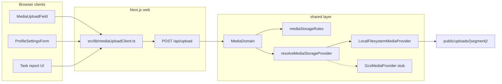

# Media Storage — Unified Upload Architecture

**Status:** In progress (local filesystem active; GCS stub wired for deployment).

## Goal

One storage pipeline for all user-generated images and videos across Nexus:

| Consumer | Purpose key | Allowed media | Max size |
|----------|-------------|---------------|----------|
| Profile settings avatar picker | `avatar` | Images | 2 MB |
| Puck page root background image | `page-cover` | Images | 5 MB |
| Puck block image/video fields | `puck-block` | Images + videos | 5 MB / 50 MB |
| Future task report attachments | `task-report` | Images + videos | 5 MB / 100 MB |
| Generic fallback | `general` | Images + videos | 5 MB / 50 MB |

Changing storage backend (local disk → Google Cloud Storage) must require **only** env changes and completing the GCS provider — not edits to Puck fields, profile UI, or API route callers.

---

## Architecture



### Layer responsibilities

| Path | Role |
|------|------|
| `shared/constants/mediaStorage.ts` | Purpose keys, size limits, storage folder segments |
| `shared/lib/mediaStorage/mediaStorageRules.ts` | Pure validation + filename/URL helpers (unit tested) |
| `shared/lib/mediaStorage/localFilesystemProvider.ts` | Dev/default writer to `public/uploads/` |
| `shared/lib/mediaStorage/gcsMediaProvider.ts` | Deployment stub — throws until SDK wired |
| `shared/lib/mediaStorage/resolveMediaStorageProvider.ts` | Env-driven provider factory + singleton cache |
| `shared/domains/MediaDomain.ts` | Single domain entry: validate → persist → return URL |
| `src/app/api/upload/route.ts` | Multipart API; auth via `isApiAuthorised` |
| `src/lib/mediaUploadClient.ts` | App-wide browser upload helper |

---

## API contract

### `POST /api/upload`

**Auth:** Session required (or dev bypass when `NEXTAUTH_SECRET` unset — same as other editor APIs).

**Multipart fields:**

| Field | Required | Description |
|-------|----------|-------------|
| `file` | Yes | Binary payload |
| `purpose` | No | One of `avatar`, `page-cover`, `puck-block`, `task-report`, `general`. Defaults to `puck-block`. |
| `ownerKey` | No | Namespace hint (user id, page slug, task id) for future delete/replace hooks |

**Success (200):**

```json
{
  "url": "/uploads/avatars/my-photo-1718640000000-123456789.png",
  "purpose": "avatar",
  "storageKey": "avatars/my-photo-1718640000000-123456789.png"
}
```

**Errors:** `400` validation (MIME, size, purpose), `401` unauthorised, `500` provider failure.

---

## Local filesystem layout

All uploads live under `public/uploads/` in purpose-specific subfolders (never at `public/uploads/` root):

```
public/uploads/
  avatars/          ← profile photos
  page-covers/      ← Puck page background images
  puck-blocks/      ← inline block media
  task-reports/     ← future task submissions
  general/          ← fallback
```

Binary files are **gitignored**; `.gitkeep` files preserve folder structure.

URLs are root-relative (`/uploads/avatars/...`) and served by Next.js static hosting.

---

## Environment variables

| Variable | Default | Description |
|----------|---------|-------------|
| `MEDIA_STORAGE_DRIVER` | `local` | `local` or `gcs` |
| `GCS_MEDIA_BUCKET` | — | Required when driver is `gcs` |
| `GCS_MEDIA_PUBLIC_BASE_URL` | — | Optional CDN/base URL prefix for public GCS objects |

See `.env.local.example`.

---

## Deployment migration (future)

1. Set `MEDIA_STORAGE_DRIVER=gcs` and provision `GCS_MEDIA_BUCKET`.
2. Implement `GcsMediaProvider.upload` using `@google-cloud/storage` (or signed upload URLs).
3. Optionally add a one-off migration script to copy `public/uploads/**` into the bucket.
4. Update `next.config.ts` `images.remotePatterns` if avatars/covers are served from a CDN hostname.

No changes required in:

- `MediaUploadField`, `ImageField`, `PageBackgroundFieldGroup`
- `ProfileSettingsForm`
- `src/lib/mediaUploadClient.ts`

---

## Client usage

```typescript
import { uploadMediaFile } from "@/lib/mediaUploadClient";

// Profile avatar
await uploadMediaFile(file, { accept: "image", purpose: "avatar", ownerKey: userId });

// Puck page cover
await uploadMediaFile(file, { accept: "image", purpose: "page-cover" });

// Puck block (default purpose when omitted in API)
await uploadMediaFile(file, { accept: "both", purpose: "puck-block" });
```

---

## Acceptance criteria

- [x] Single domain entry (`MediaDomain.upload`) for all server-side uploads
- [x] Purpose-based validation (MIME + size) centralised in `mediaStorageRules.ts`
- [x] Local provider writes to segmented folders under `public/uploads/`
- [x] GCS provider stub + env wiring for future deployment
- [x] App-wide client helper (`src/lib/mediaUploadClient.ts`)
- [x] Profile avatar upload uses `purpose=avatar`
- [x] Page background upload uses `purpose=page-cover`
- [x] Puck block fields use `purpose=puck-block`
- [x] Unit tests for validation rules
- [ ] GCS provider implementation (deferred to deployment)
- [ ] Task report UI integration (Phase 5)
- [ ] Orphan file cleanup when avatar/cover replaced (future enhancement)

---

## Related docs

- [architecture_map.md](../architecture_map.md) — `public/uploads/` subfolders, `shared/domains/MediaDomain.ts`
- [directory_hygiene.md](../directory_hygiene.md) — upload folder policy
- [auth_and_profiles.md](./auth_and_profiles.md) — avatar field on User model
- [puck_editor.md](./puck_editor.md) — block media fields
