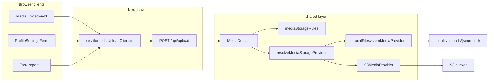

# Media Storage — Unified Upload Architecture

**Status:** `[x] Completed` — local filesystem (dev) + Amazon S3 (production) + orphan cleanup.

## Goal

One storage pipeline for all user-generated images and videos across Nexus:

| Consumer | Purpose key | Allowed media | Max size |
|----------|-------------|---------------|----------|
| Profile settings avatar picker | `avatar` | Images | 2 MB |
| Puck page root background image | `page-cover` | Images | 5 MB |
| Puck block image/video fields | `puck-block` | Images + videos | 5 MB / 50 MB |
| Future task report attachments | `task-report` | Images + videos | 5 MB / 100 MB |
| Generic fallback | `general` | Images + videos | 5 MB / 50 MB |

Changing storage backend (local disk → Amazon S3) must require **only** env changes — not edits to Puck fields, profile UI, or API route callers.

---

## Architecture



### Layer responsibilities

| Path | Role |
|------|------|
| `shared/constants/mediaStorage.ts` | Purpose keys, size limits, storage folder segments |
| `shared/lib/mediaStorage/mediaStorageRules.ts` | Pure validation + filename/URL helpers (unit tested) |
| `shared/lib/mediaStorage/localUploadInventory.ts` | List files under `public/uploads/` for orphan scans |
| `shared/lib/mediaStorage/uploadReferenceUtils.ts` | Parse `/uploads/…` paths; walk JSON for references |
| `shared/lib/mediaStorage/orphanUploadCleanupLogic.ts` | Orphan detection + min-age rules |
| `shared/lib/mediaStorage/localFilesystemProvider.ts` | Dev/default writer to `public/uploads/` |
| `shared/lib/mediaStorage/s3MediaProvider.ts` | S3 upload, delete, and bucket inventory listing |
| `shared/lib/mediaStorage/s3ObjectKey.ts` | S3 public URL build/parse for reference scanning |
| `shared/lib/mediaStorage/storageObjectKey.ts` | Shared storage-key normalisation for all cloud drivers |
| `shared/lib/mediaStorage/resolveMediaStorageProvider.ts` | Env-driven provider factory + singleton cache |
| `shared/domains/MediaDomain.ts` | Single domain entry: validate → persist → return URL |
| `src/app/api/upload/route.ts` | Multipart API; auth via `isApiAuthorised` |
| `src/app/api/upload/from-url/route.ts` | JSON remote image import API |
| `src/app/api/admin/jobs/media-orphan-cleanup/route.ts` | HTTP trigger for orphan cleanup job |
| `shared/lib/mediaStorage/remoteImageImport.ts` | SSRF-safe HTTPS fetch + raster MIME sniff for link import |
| `scripts/jobs/mediaOrphanCleanup.ts` | CLI orphan cleanup entrypoint |
| `src/instrumentation.ts` | Optional in-process cleanup scheduler |
| `src/lib/mediaOrphanCleanupScheduler.ts` | Interval runner for orphan cleanup |
| `src/lib/mediaUploadClient.ts` | App-wide browser upload + import helpers |

---

## API contract

### `POST /api/upload`

**Auth:** Session required (or dev bypass when `NEXTAUTH_SECRET` unset — same as other editor APIs).

**Multipart fields:**

| Field | Required | Description |
|-------|----------|-------------|
| `file` | Yes | Binary payload |
| `purpose` | No | One of `avatar`, `page-cover`, `puck-block`, `task-report`, `general`. Defaults to `puck-block`. |
| `ownerKey` | No | Namespace hint (user id, page slug, task id) for future delete/replace hooks |

**Success (200):**

```json
{
  "url": "/uploads/avatars/my-photo-1718640000000-123456789.png",
  "purpose": "avatar",
  "storageKey": "avatars/my-photo-1718640000000-123456789.png"
}
```

**Errors:** `400` validation (MIME, size, purpose), `401` unauthorised, `500` provider failure.

### `POST /api/upload/from-url`

**Auth:** Same as `/api/upload`.

**JSON body:**

| Field | Required | Description |
|-------|----------|-------------|
| `url` | Yes | Public **HTTPS** URL of a raster image (PNG, JPEG, GIF, WebP) |
| `purpose` | No | Same purpose keys as multipart upload. Purpose must allow images. |
| `ownerKey` | No | Optional namespace hint |

**Behaviour:**

1. Validates URL (HTTPS only, no credentials, blocked hosts/IPs).
2. Resolves DNS and rejects private/link-local/metadata addresses (SSRF guard).
3. Follows redirects manually (max 5) — each hop re-validated.
4. Enforces purpose image size limit while streaming the body.
5. Sniffs magic bytes (SVG/HTML rejected even if `Content-Type` lies).
6. Persists via the same `MediaDomain.upload` pipeline → `/uploads/{segment}/…`.

**Success (200):** Same JSON shape as multipart upload.

**Errors:** `400` invalid URL, blocked host, unsupported file, or size limit; `401` unauthorised; `500` provider failure.

**Client:** `importMediaImageFromUrl()` in `src/lib/mediaUploadClient.ts` (API-backed; not exposed in Puck `MediaUploadField`, which is file pick/drop only).

---

## Local filesystem layout

All uploads live under `public/uploads/` in purpose-specific subfolders (never at `public/uploads/` root):

```
public/uploads/
  avatars/          ← profile photos
  page-covers/      ← Puck page background images
  puck-blocks/      ← inline block media
  task-reports/     ← future task submissions
  general/          ← fallback
```

Binary files are **gitignored**; `.gitkeep` files preserve folder structure.

URLs are root-relative (`/uploads/avatars/...`) and served by Next.js static hosting.

---

## Environment variables

| Variable | Default | Description |
|----------|---------|-------------|
| `MEDIA_STORAGE_DRIVER` | `local` | `local` (dev) or `s3` (production on AWS EC2) |
| `S3_MEDIA_BUCKET` | — | Required when driver is `s3` |
| `S3_MEDIA_REGION` | — | Required when driver is `s3` (falls back to `AWS_REGION`) |
| `S3_MEDIA_PUBLIC_BASE_URL` | — | Optional CDN/base URL prefix for public S3 objects |
| `AWS_ACCESS_KEY_ID` / `AWS_SECRET_ACCESS_KEY` | — | Standard AWS credentials when not using an IAM role |
| `MEDIA_ORPHAN_MIN_AGE_HOURS` | `24` | Minimum file age (hours) before an unreferenced upload may be deleted |
| `MEDIA_ORPHAN_CLEANUP_INTERVAL_HOURS` | — | When set to a positive number, Next.js server runs cleanup on that interval via `src/instrumentation.ts` |
| `MEDIA_ORPHAN_CLEANUP_CRON_SECRET` | — | Bearer token for `POST /api/admin/jobs/media-orphan-cleanup` (Admin session also accepted) |

See `.env.example`.

---

## Orphan upload cleanup

Unreferenced upload objects are removed by comparing storage inventory to MongoDB references:

| Driver | Inventory source |
|--------|------------------|
| `local` | Files under `public/uploads/{segment}/` |
| `s3` | Objects in `S3_MEDIA_BUCKET` with prefixes `avatars/`, `puck-blocks/`, etc. |

Reference scanning recognises `/uploads/…` paths (local) and S3/CDN absolute URLs when `MEDIA_STORAGE_DRIVER=s3`.

| Source | Fields scanned |
|--------|----------------|
| `users` | `avatar` |
| `pages` | entire `puckData` JSON (images, videos, page backgrounds) |

**Safety:** files newer than `MEDIA_ORPHAN_MIN_AGE_HOURS` are never deleted (protects uploads not yet saved to MongoDB).

**Triggers (local or S3):**

| Method | Command / endpoint |
|--------|-------------------|
| CLI dry-run | `npm run job:media-orphan-cleanup:dry-run` |
| CLI delete | `npm run job:media-orphan-cleanup` |
| HTTP cron | `GET` or `POST` on `/api/admin/jobs/media-orphan-cleanup` with `?dryRun=true` or `{ "dryRun": true }` |
| In-process schedule | Set `MEDIA_ORPHAN_CLEANUP_INTERVAL_HOURS=24` |

**Auth for HTTP job:** Unified `CRON_SECRET` or `NEXUS_CRON_SECRET` Bearer token, legacy `MEDIA_ORPHAN_CLEANUP_CRON_SECRET`, or an Admin session. See [scheduled_events.md](./scheduled_events.md).

Example host cron (daily at 03:00):

```bash
curl -sS -X POST \
  -H "Authorization: Bearer $MEDIA_ORPHAN_CLEANUP_CRON_SECRET" \
  -H "Content-Type: application/json" \
  -d '{"dryRun":false}' \
  "$NEXTAUTH_URL/api/admin/jobs/media-orphan-cleanup"
```

**S3 auth:** set `AWS_ACCESS_KEY_ID` and `AWS_SECRET_ACCESS_KEY`, or run on AWS EC2 with an IAM instance role. The principal needs `s3:PutObject`, `s3:DeleteObject`, and `s3:ListBucket` on the media bucket and its object prefixes.

---

## Deployment migration (Amazon S3)

1. Set `MEDIA_STORAGE_DRIVER=s3`, `S3_MEDIA_BUCKET`, and `S3_MEDIA_REGION` (or `AWS_REGION`).
2. Configure the bucket for public read (or front it with CloudFront) and optionally set `S3_MEDIA_PUBLIC_BASE_URL`.
3. Optionally copy `public/uploads/**` into the bucket using the same `{segment}/{filename}` keys.
4. Update `next.config.ts` `images.remotePatterns` for the S3 or CloudFront hostname.

No changes required in:

- `MediaUploadField`, `ImageField`, `PageBackgroundFieldGroup`
- `ProfileSettingsForm`
- `src/lib/mediaUploadClient.ts`

---

## Client usage

Image uploads from profile settings and Puck fields open the app-wide crop dialog first (see [image_crop_editor.md](./image_crop_editor.md)). Use `uploadMediaFileWithCrop` for the default flow, or `skipCrop: true` to bypass.

```typescript
import { uploadMediaFile, uploadMediaFileWithCrop } from "@/lib/mediaUploadClient";

// Profile avatar (crop dialog → upload)
await uploadMediaFileWithCrop(file, { accept: "image", purpose: "avatar", ownerKey: userId });

// Puck page cover
await uploadMediaFileWithCrop(file, { accept: "image", purpose: "page-cover" });

// Puck block (default purpose when omitted in API)
await uploadMediaFileWithCrop(file, { accept: "both", purpose: "puck-block" });

// Skip crop (direct upload)
await uploadMediaFile(file, { purpose: "puck-block", skipCrop: true });

// Import remote HTTPS image into local storage
await importMediaImageFromUrl("https://cdn.example.com/photo.png", { purpose: "puck-block" });
```

---

## Acceptance criteria

- [x] Single domain entry (`MediaDomain.upload`) for all server-side uploads
- [x] Purpose-based validation (MIME + size) centralised in `mediaStorageRules.ts`
- [x] SVG uploads rejected at validation (`image/svg+xml` blocked; raster only)
- [x] Local provider writes to segmented folders under `public/uploads/`
- [x] S3 provider (`upload`, `delete`, `listInventory`) via `@aws-sdk/client-s3`
- [x] Periodic orphan upload cleanup (DB reference scan; local + S3)
- [ ] Task report UI integration (Phase 5)

---

## Related docs

- [architecture_map.md](../architecture_map.md) — `public/uploads/` subfolders, `shared/domains/MediaDomain.ts`
- [directory_hygiene.md](../directory_hygiene.md) — upload folder policy
- [auth_and_profiles.md](./auth_and_profiles.md) — avatar field on User model
- [puck_editor.md](./puck_editor.md) — block media fields
