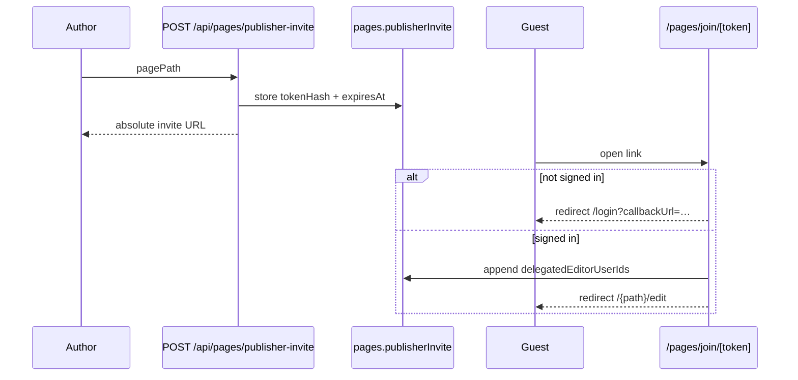

# Page Publisher Invite Links

**Status:** `[x] Completed`

**Related:** [page_access_and_paths.md](./page_access_and_paths.md), [page_metadata_and_engagement.md](./page_metadata_and_engagement.md)

---

## Overview

Editors who can manage the publisher roster may generate a **shareable invite link**. When another signed-in user opens the link, they are added to `delegatedEditorUserIds` and redirected into the Puck editor for that page.

This complements the manual **+** user search in Publication → Publisher.

---

## Flow

---

## Data model

| Layer | Field | Notes |
|-------|-------|-------|
| MongoDB `pages` | `publisherInvite.tokenHash` | SHA-256 of opaque token — plain token never stored |
| MongoDB `pages` | `publisherInvite.expiresAt` | Default TTL 7 days (`PAGE_PUBLISHER_INVITE_TTL_MS`) |
| MongoDB `pages` | `publisherInvite.createdBy` | User who generated the link |
| MongoDB `pages` | `delegatedEditorUserIds` | Updated on successful redemption |

Pure helpers: `shared/lib/pagePublisherInviteLogic.ts`  
Domain: `PageDomain.createPublisherInviteLink()`, `PageDomain.redeemPublisherInvite()`

---

## Security rules

| Rule | Implementation |
|------|----------------|
| Only roster managers may create links | `canManagePageAccess()` in `PageDomain.createPublisherInviteLink()` |
| Page must exist in MongoDB | 404 when not persisted |
| Invite expires | `validatePagePublisherInviteToken()` |
| Rotating links | Each create call replaces `publisherInvite` (previous link stops working) |
| Author already has access | Redirect to editor (`alreadyMember: true`) |
| Roster cap | Respects `MAX_PAGE_ACCESS_EDITORS` on redeem |

---

## API & routes

| Route | Method | Auth | Purpose |
|-------|--------|------|---------|
| `/api/pages/publisher-invite` | POST | Session | `{ pagePath }` → `{ url, expiresAt, pagePath }` |
| `/pages/join/[token]` | GET | Session (login redirect) | Redeem invite → editor redirect |

---

## Editor UI

| Piece | File |
|-------|------|
| Create / copy invite link | `PagePublisherInviteShare.tsx` (Publication → Publisher) |
| Client fetch | `pagePublisherInviteClient.ts` |

First click in an editor session calls the API and caches the URL for subsequent copies without rotating again until reload.

---

## Tests

| Script | Module |
|--------|--------|
| `npm run test:page-publisher-invite-logic` | `pagePublisherInviteLogic.ts` |

---

## Acceptance criteria

- [x] Manager can create and copy an invite link for a persisted page
- [x] Recipient must sign in before redemption
- [x] Successful redemption grants edit access via `delegatedEditorUserIds`
- [x] Invalid / expired links show a readable static error panel
- [x] Unpersisted pages disable invite creation in the sidebar
