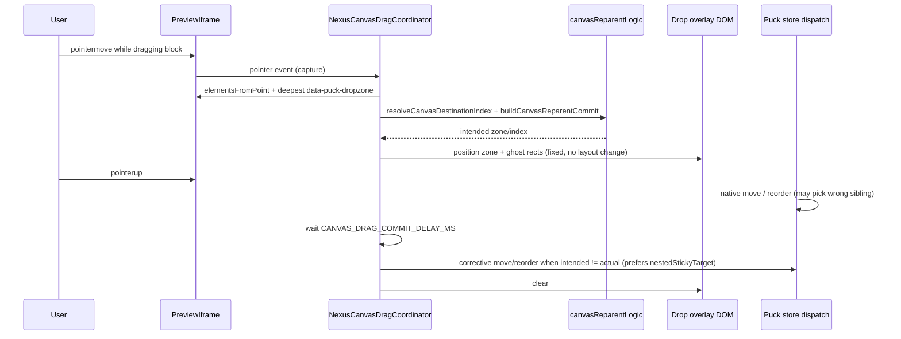

# Puck Canvas Drag-and-Drop — Slot Reparenting & Drop Highlights

**Status:** `[x] Completed`

---

## 1. Overview

Canvas drag-and-drop lets editors **reparent** existing blocks (e.g. move Video Player from the page root into a carousel slide or grid cell) using Puck's native `@dnd-kit` pipeline, enhanced by a Nexus **drag coordinator** when collision picks a sibling instead of a nested slot. This is separate from **Outline panel** drag ([`NexusDraggableOutline.tsx`](../../src/components/puck/NexusDraggableOutline.tsx)), which uses a custom pointer coordinator.

Nexus enhances Puck's default drop UX so that:

1. **All slot containers** accept reparenting reliably (deepest-zone hit-testing + post-drop `move` dispatch).
2. **Drop highlights** render in a fixed overlay layer sized from the dragged block — **no layout mutation** on live drop zones.
3. **Edge auto-scroll** — while dragging near the viewport edge, the canvas scrollport, outline panel, and page scroll advance automatically (`useDragAutoScroll` in `src/lib/`; wired in `NexusCanvasDragCoordinator` and `NexusOutlineDragContext`).

---

## 2. Slot inventory

Every Puck **slot** must register a CSS marker class on the slot element in edit mode:

| Block | Slot field | CSS class on slot | Slot composition |
|-------|-----------|-------------------|------------------|
| Page root | `content` | `[data-puck-dropzone]` (Puck root) | — |
| [`NexusSection`](../../src/components/puck/blocks/layout/NexusSection.tsx) | `content` | `nexus-section__dropzone` | — |
| [`NexusColumns`](../../src/components/puck/blocks/layout/NexusColumns.tsx) | `left`, `right` | `nexus-columns__dropzone` | — |
| [`NexusGrid`](../../src/components/puck/blocks/layout/NexusGrid.tsx) | `content` | `nexus-grid` | `allow: ["NexusGridItem"]` |
| [`NexusGridItem`](../../src/components/puck/blocks/layout/NexusGridItem.tsx) | `content` | `nexus-grid-item` | `disallow: ["NexusGridItem", "NexusGrid"]` |
| [`NexusCarousel`](../../src/components/puck/blocks/content/NexusCarousel.tsx) | `slides[].content` | `nexus-carousel__dropzone` | — |
| [`NexusTabs`](../../src/components/puck/blocks/content/NexusTabs.tsx) | `tabs[].panel` | `nexus-tabs__dropzone` | — |

Leaf blocks (Text, Video, Image, Button, List, etc.) are **drag sources only** — they inherit shared pointer-event rules during drag; no per-block DnD code is required.

---

## 3. Architecture

| File | Role |
|------|------|
| [`canvasReparentLogic.ts`](../../src/components/puck/lib/canvasReparentLogic.ts) | Pure reparent: destination index, descendant guard, commit builder |
| [`canvasDropTargetLogic.ts`](../../src/components/puck/lib/canvasDropTargetLogic.ts) | Hit-test (deepest zone), overlay sizing metrics |
| [`NexusCanvasDragCoordinator.tsx`](../../src/components/puck/NexusCanvasDragCoordinator.tsx) | Pointer tracking, overlay injection, post-drop Puck dispatch |
| [`puckEditorOverrides.tsx`](../../src/components/puck/puckEditorOverrides.tsx) | Mounts coordinator via `overrides.puck` |
| [`puck-editor.css`](../../src/app/puck-editor.css) | Overlay styles; pointer pass-through during drag |
| [`globals.css`](../../src/app/globals.css) | Carousel/grid drag overflow helpers (no dynamic min-height) |

**Critical constraint:** The coordinator dispatches Puck actions **once** after drag end when native collision missed the intended nested slot. It does not debounce parent `data` (see [puck_editor_performance.md](./puck_editor_performance.md)).

---

## 4. Overlay preview

| Element | Purpose |
|---------|---------|
| `#nexus-canvas-drop-overlay` | Fixed root in preview iframe (`pointer-events: none`) |
| `.nexus-canvas-drop-overlay__zone` | Full container dashed highlight |
| `.nexus-canvas-drop-overlay__ghost` | Dragged-block footprint at insertion position |

Sizing math reuses `resolveCanvasDropTargetMetrics` — applied as explicit overlay `width`/`height`, not `--min-empty-height` on drop zones.

---

## 5. Sizing rules (`resolveCanvasDropTargetMetrics`)

- **Empty slot:** `minHeight = max(containerHeight, draggedHeight)` — tall video previews fill carousel slides / grid cells.
- **Occupied slot (append):** `minHeight = max(containerHeight - sum(childHeights), draggedHeight)`.
- **Floor:** `80px` (`CANVAS_DROP_TARGET_MIN_PX`).
- **Fallback dragged height:** `128px` when the drag ghost cannot be measured.

Tests: `npm run test:canvas-drop-target`, `npm run test:canvas-reparent`

---

## 6. Pointer-events during drag

`NexusCanvasDragCoordinator` sets `data-puck-dragging` on the preview iframe's `<html>` while Puck reports `ui.isDragging` or a palette/canvas drag is active. All rules below depend on that marker.

While `[data-puck-dragging]` is active on the preview document:

- Nested **iframe / video / poster / carousel controls** inside drop zones use `pointer-events: none` so the pointer reaches the slot surface.
- **Inactive carousel slides** (`nexus-carousel__slide--inactive-edit`) re-enable `pointer-events: auto` so blocks can move between slides in single-slide edit mode.
- Carousel edit drop zones use `overflow: visible` during drag so hitboxes are not clipped.

### 6a. Top-anchor drop probe (all components)

Slot hit-testing during drag **does not** use the live pointer position. Instead, {@link resolveCanvasDropProbePoint} maps every move/release to a canonical probe on the drag ghost:

| Axis | Rule |
|------|------|
| **Y** | Top edge of the drag ghost + `CANVAS_DROP_PROBE_TOP_INSET_PX` (12px) |
| **X** | Live pointer X, clamped to the ghost horizontal bounds |

**Why:** Tall blocks (Video Player, Image, Carousel) behave differently when grabbed at the top vs bottom — the pointer lags behind the visible ghost, so a bottom grab often hit-tests sibling slots instead of nested targets (carousel slides, grid cells, sections). Top-anchor probing makes every grab point behave like a top-edge grab.

**Scope:** Applies to **all** canvas reparent drags and **Blocks sidebar** palette inserts. Reorder index *within* an already-selected zone still uses the raw pointer Y ({@link resolveCanvasDestinationIndex}).

**Future blocks:** No per-block code is required — any drag ghost matched by {@link readCanvasDragGhostElement} automatically uses top-anchor probing.

---

## 7. Adding a new block with slots (developer checklist)

1. Register the slot field in the block's `fields` object (`type: "slot"`).
2. In `render`, when `puck.isEditing`, pass a **unique** `className` from [`NEXUS_SLOT_DROPZONE_CLASS`](../../src/components/puck/lib/canvasDropTargetLogic.ts) (or add a new entry there + CSS).
3. Pass `minEmptyHeight={120}` (or carousel/tab equivalent) in edit mode on the slot component — **container-level only**; avoid permanent `minEmptyHeight` on nested grid items (height-loop risk).
4. Do **not** set `pointer-events: auto` on edit-mode media inside slots without a `[data-puck-dragging]` guard.
5. Avoid `overflow: hidden` on the drop-zone element unless drag overrides exist in `puck-editor.css`.
6. Add the class to the **Canvas drag — slot drop targets** section in `puck-editor.css`.
7. Update this document's slot inventory table.

---

## 8. Troubleshooting

| Symptom | Likely cause | Fix |
|---------|--------------|-----|
| Dragged glass block shows underlying video/image | Translucent glass during drag | `[data-puck-dragging]` solid background rules in `puck-editor.css` |
| Canvas height grows infinitely during drag | Legacy min-height on live drop zones | Ensure overlay-only previews; no `--nexus-drop-preview-min-height` on layout nodes |
| Drop never registers on carousel slide | Inactive slide `pointer-events: none` or media capturing hits | Confirm `[data-puck-dragging]` carousel overrides in `puck-editor.css`; verify coordinator sets `data-puck-dragging` on preview `<html>` |
| Cannot drag at all in DevTools / mobile | `event.buttons === 0` on emulated touch aborts tracking; drag marker never set | Coordinator uses Puck `isDragging` + `setCanvasDragMarker`; `touch-action: none` on preview during drag |
| Highlight missing | Coordinator not mounted | Verify `NexusCanvasDragCoordinator` in `overrides.puck` |
| Stacked dashed footprints while dragging | Global `min-height: 180px` on every empty nested drop zone during drag | Collapse live zone chrome under `html[data-puck-dragging]`; overlay-only preview via `#nexus-canvas-drop-overlay` |
| Block swaps at same level instead of nesting | Puck sibling collision; large ghost blocks hit-test; pointer-up on parent window used wrong coords and overwrote nested sticky target | Geometry fallback + nested sticky ref; `shouldKeepStickyDropTarget`; parent pointerup mapped through iframe; 320ms commit delay after Puck drag end |
| Wrong carousel slide highlighted (slide 1 while cursor over slide 2) | Puck `DropZone--isDestination` on stale slide; drop-zone rect taller than slide card; area pick ignored pointer X | `resolveCarouselSlideDropZoneAtPoint` walks `.nexus-carousel__slide` cards; `pickInnermostDropZone` filters by slide measure rect; sticky never locks across distinct slides on same carousel |
| Drag ghost "island" in source slide | Puck leaves `[data-dnd-dragging]` component visible in carousel slot while overlay tracks cursor; drag marker cleared before dnd ghost unmounts | Hide in-carousel drag source under `html[data-puck-dragging]` (collapse slide + dropzone shell); keep drag marker until post-commit; freeze edit-height sync + Embla scroll + slide activate during drag |
| Dashed band below slide (not dragging) | Multi-slide `align-items: stretch` + empty sibling min-height + Puck dropzone outline/append hitbox below fill media | Per-slide `flex-start` height in multi-slide edit; hide carousel Puck dropzone outlines + hitboxes; fill-media slides `height: auto` |
| Append ghost at bottom of slide during drag | Source slot still counts dragged block as occupied → append-position overlay | `isCanvasDropZoneEmptyForDrag`; carousel overlay always fills slide card; hide overlay on source slide while dragging |
| Snap to root / wrong slide | Hit-test returned page root below carousel | `resolveCarouselSlideDropZoneAtPoint` wins over root compound keys |
| Block jumps to wrong slide after drop | Sticky nested ref overrode final pointer target; carousel layout shifted mid-drag | Commit prefers `releaseTargetRef` then `nestedStickyTargetRef`; carousel defers `scrollToEditPage` / height sync while dragging |
| Cross-slide drop reverts after ~320ms (outline shows move then undo) | Pointer-up / late hover hit-test snaps release target back to source slide while Puck already moved to neighbor; delayed commit undoes native drop | `shouldAcceptCanvasReleaseTargetUpdate` rejects source downgrade on **hover and release**; `resolveCanvasDragCommitPlan` skips commit when `intended === dragStart` but Puck landed elsewhere; commit uses `releaseTargetRef` only; pre-commit re-hit-test with last pointer coords |
| Dashed band below carousel (idle) | Viewport/track kept `min-height: 240px` while slides were content-sized after `flex-start` | Multi-slide edit: viewport + track `min-height: 0; height: auto` when not `edit-height-sync` |
| Cannot drag block out of carousel slide | Release guard blocked nested→root updates during pointer-move | Guards run only on `release`; hover phase always tracks root targets |
| Cross-slide drag never leaves source slide (overlay flickers on neighbor) | Hover over source slide overwrote `releaseTargetRef`; carousel wrapper beat slide geometry in hit-test | `shouldSkipCarouselSourceSlideHoverUpdate`; prefer `resolveCarouselSlideDropZoneAtPoint` over same-carousel non-slide merged zones |
| No drop highlight in default Section (glass island) | Inner slot rect smaller than visible glass shell; occupied sections hid overlay outline | `resolveSectionDropZoneAtPoint`; measure section via `.glass-panel`; `showContainerOutline` for `section` slot kind |
| Must pixel-hunt to drop into carousel slide (gap, arrows, dots) | `resolveCarouselSlideDropZoneAtPoint` required pointer strictly inside slide card rect | When pointer is inside `.nexus-carousel` but outside slide cards, pick nearest slide by center distance |
| Bottom grab only reorders siblings; top grab nests into slots | Hit-test used live pointer Y — lags below ghost top on tall blocks | `resolveCanvasDropProbePoint` — universal top-anchor probe (`CANVAS_DROP_PROBE_TOP_INSET_PX`) for all drag ghosts |
| Drag ghost/footprint misaligned or below carousel | Overlay sized from inflated `[data-puck-dropzone]` rect instead of visible slide card | `getCanvasDropZoneMeasureRect` → `.nexus-carousel__slide`; empty carousel ghosts fill full slide card (`slotKind: carousel-slide`) |
| Slot treated as occupied while dragging source block | `isCanvasDropZoneEmpty` counted `[data-dnd-dragging]` ghost as a child | Exclude `[data-dnd-dragging]` / `[data-puck-dragging]` from empty + child-height measurement |
| Blue selection frame wrong size after nest | Puck overlay not re-measured post-commit | `syncPuckComponentOverlayAfterLayout` in coordinator after corrective `move`/`reorder` |
| Video/image overlaps slide chrome in Interactive mode | Multi-slide interactive used absolute fill without edit-height sync — slot height collapsed and iframe cover bled upward | Interactive multi-slide fill uses in-flow `aspect-ratio` layout; `--nexus-media-aspect-ratio` propagated to slide; fill dropzones excluded from `position: relative` override |
| Video nested in carousel slide but invisible (Edit + Interactive) | Fill class applied one frame late; CSS `:has(.slide-media-fill)` + `edit-height-sync` switched to absolute cover before class existed; Puck selection overlay showed empty dropzone | `CarouselSlideMediaContext` for sync fill on first paint; `data-nexus-carousel-fill` attr; in-flow frame `aspect-ratio` only (absolute cover reserved for fixed-height); immediate YouTube poster |
| Outline drag works, canvas does not | Separate systems | Canvas uses coordinator + Puck DnD; outline uses `NexusOutlineDragContext` |

---

## 9. Manual smoke (Edit mode)

1. Drag **Video Player** from root → empty **carousel slide** → commits; overlay fills slide; canvas height stable.
2. Drag **Video Player** → **grid cell** with nested carousel → commits into slide slot.
3. Drag **Text** between **grid columns** (reorder + reparent).
4. Drag block into **Tab panel**, **Column**, **Section** slots.
5. Drag **Image** into carousel slide with existing content (append area).
6. Outline drag still works (regression).

Run: `npm run test:canvas-drop-target && npm run test:canvas-reparent && npm run test:canvas-carousel-drag && npm run test:canvas-section-drop`

---

*See also:* [puck_editor.md §6c](./puck_editor.md) · [puck_editor_enhancements.md §29](./puck_editor_enhancements.md)
