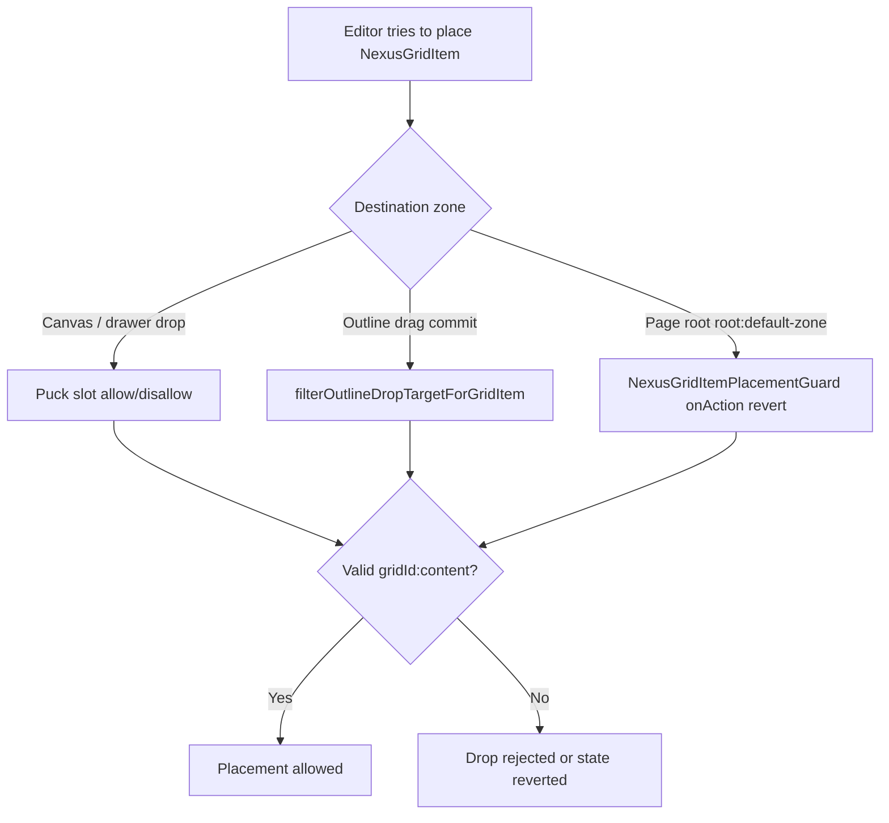

# Puck Grid Item zone policy

**Status:** `[x] Legacy guard` — standalone **`NexusGridItem`** blocks removed from the Blocks drawer (2026-06-17). Grid cells now live on **`NexusGrid.props.items`** (array field). This document + `nexusGridItemZonePolicy.ts` remain for legacy page migration and `disallow: ["NexusGridItem"]` on other slots.

---

## 1. Product rule

**`NexusGridItem` (Grid Item) may only exist as a direct child of a `NexusGrid` (Grid Layout) `content` slot.**

Grid items are inline CSS grid cells (`grid-column` / `grid-row` on the slot element). They must be **direct children** of the grid container’s drop zone, not nested inside sections, columns, carousel slides, tab panels, other grid-item cells, or the page root.

| Block | Role |
|-------|------|
| `NexusGrid` | Grid container — **only** block that may contain grid items |
| `NexusGridItem` | Grid cell — holds normal content blocks inside its own `content` slot, **not** other grid items |

---

## 2. Valid destination (canonical)

The policy module defines the **only** valid placement zone:

```
{gridBlockId}:content
```

Where:

- `{gridBlockId}` is the Puck `props.id` of a block whose registry type is `NexusGrid`.
- The slot path after `:` is exactly `content` (the `NexusGrid` slot field name).

**Examples**

| Zone compound | Valid? | Reason |
|---------------|--------|--------|
| `abc123:content` | Yes | Parent `abc123` is `NexusGrid`, slot is `content` |
| `root:default-zone` | No | Page root legacy zone |
| `section1:content` | No | Parent is `NexusSection`, not `NexusGrid` |
| `item1:content` | No | Parent is `NexusGridItem` (cell inner slot), not the grid |
| `carousel:slides[0].content` | No | Carousel slide slot |
| `tabs: tabs[1].panel` | No | Tab panel slot |

Puck encodes nested/array slots with path segments (e.g. `slides[0].content`); the policy requires **both** an exact slot id of `content` **and** a parent node typed `NexusGrid`.

---

## 3. Related slot composition rules

These rules complement placement policy (prevent invalid nesting *inside* a valid grid item):

| Block | Slot | Rule |
|-------|------|------|
| `NexusGrid` | `content` | `allow: ["NexusGridItem"]` — only grid items in the grid |
| `NexusGridItem` | `content` | `disallow: ["NexusGridItem", "NexusGrid"]` — no nested grids or cells |
| All other slot hosts | various | `disallow: ["NexusGridItem"]` via shared constant |
| `NexusCarousel` | `slides[].content` | `disallow: NexusGridItem`, `NexusCarousel` — no nested carousels |

Shared constant (import in block field configs):

```ts
import { DISALLOW_NEXUS_GRID_ITEM } from "@/components/puck/lib/nexusGridItemZonePolicy";
// disallow: [...DISALLOW_NEXUS_GRID_ITEM]
```

Blocks that register `disallow`: `NexusSection`, `NexusCarousel` (per-slide `content`), `NexusTabs` (per-tab `panel`).

---

## 4. Enforcement layers

Puck validates slot `allow` / `disallow` on canvas drag for nested slots. Three gaps required Nexus helpers:



| Layer | Mechanism | File(s) |
|-------|-----------|---------|
| **Slot fields** | Puck `DropZoneEdit.acceptsTarget` reads `allow` / `disallow` on slot config | Layout/content block `fields` |
| **Outline drag** | Drop targets filtered before hover commit; `handleCommit` no-ops invalid moves | [`outlineSortableLogic.ts`](../../src/components/puck/lib/outlineSortableLogic.ts), [`NexusOutlineDragContext.tsx`](../../src/components/puck/NexusOutlineDragContext.tsx), [`NexusDraggableOutline.tsx`](../../src/components/puck/NexusDraggableOutline.tsx) |
| **Page root** | Legacy root uses `root:default-zone` without a root slot field — invalid placements reverted via `onAction` + `setData` | [`NexusGridItemPlacementGuard.tsx`](../../src/components/puck/NexusGridItemPlacementGuard.tsx), [`PuckEditorShell.tsx`](../../src/app/[...puckPath]/PuckEditorShell.tsx) — indexes via `getPuck().__private.appState.indexes` |

Root guard scans Puck `indexes` after `insert` / `move` / `reorder` / `duplicate` / `replace` and restores previous `data` when any `NexusGridItem` is misplaced.

---

## 5. Policy module API

**Module:** [`src/components/puck/lib/nexusGridItemZonePolicy.ts`](../../src/components/puck/lib/nexusGridItemZonePolicy.ts)

**Tests:** `tests/puck/lib/nexusGridItemZonePolicy.test.ts` — `npm run test:nexus-grid-item-zone`

### Constants

| Export | Value / meaning |
|--------|-----------------|
| `NEXUS_GRID_ITEM_TYPE` | `"NexusGridItem"` |
| `NEXUS_GRID_TYPE` | `"NexusGrid"` |
| `NEXUS_GRID_CONTENT_SLOT` | `"content"` |
| `PUCK_ROOT_DROPPABLE_ID` | `"root:default-zone"` |
| `DISALLOW_NEXUS_GRID_ITEM` | `["NexusGridItem"]` — spread into non-grid slot `disallow` |

### Core validators

| Function | Purpose |
|----------|---------|
| `parseZoneCompound(zoneCompound)` | Split `parentId:slotPath` |
| `isNexusGridContentZone(zone, nodes)` | True when zone is `{gridId}:content` and parent type is `NexusGrid` |
| `isValidNexusGridItemDestinationZone(zone, nodes)` | Alias of `isNexusGridContentZone` — public name for drop validation |
| `findZoneCompoundForItemId(itemId, zones)` | Resolve which zone currently holds a block |
| `findMisplacedNexusGridItemIds(indexes)` | All grid item ids not in a valid grid content zone |
| `hasMisplacedNexusGridItems(indexes)` | Boolean convenience for guards |
| `isGridItemPlacementAction(action)` | True for Puck actions that can change tree placement |
| `shouldRejectNexusGridItemInsert(action, nodes)` | True when an `insert` of `NexusGridItem` targets an invalid zone |
| `resolvePuckEditorIndexes(puck)` | Read `indexes` from `getPuck().__private.appState` (public `appState` has no indexes) |

### Outline integration

[`filterOutlineDropTargetForGridItem`](../../src/components/puck/lib/outlineSortableLogic.ts) wraps outline drop resolution: if the dragged block is `NexusGridItem` and the destination zone fails `isValidNexusGridItemDestinationZone`, the drop target is cleared (`null`).

---

## 6. Adding a new slot container

When introducing a new Puck block with a `type: "slot"` field that is **not** `NexusGrid.content`:

1. Import `DISALLOW_NEXUS_GRID_ITEM` from `nexusGridItemZonePolicy.ts`.
2. Set `disallow: [...DISALLOW_NEXUS_GRID_ITEM]` on that slot field.
3. Do **not** add grid items to drawer-only allow lists for that zone.
4. Extend `nexusGridItemZonePolicy.test.ts` with a zone compound example if the slot path is novel.
5. Update the slot inventory table in [`puck_canvas_drag_drop.md`](puck_canvas_drag_drop.md).

Only `NexusGrid.fields.content` uses `allow: ["NexusGridItem"]` instead of disallow.

---

## 7. Acceptance criteria

- [x] Grid Item cannot be inserted or moved to page root.
- [x] Grid Item cannot be placed in Section, Carousel slide, or Tab panel slots.
- [x] Grid Item cannot be placed inside another Grid Item’s `content` slot.
- [x] Grid Item **can** be inserted, reordered, and moved within and between `NexusGrid` `content` zones.
- [x] Outline drag does not show or commit invalid cross-zone targets for grid items.
- [x] Pure policy helpers covered by `npm run test:nexus-grid-item-zone`.

---

## 8. Related docs

- [`puck_editor.md`](puck_editor.md) — block catalog and layout category
- [`puck_canvas_drag_drop.md`](puck_canvas_drag_drop.md) — slot inventory and drag architecture; **[§2a inner-slot drops](./puck_canvas_drag_drop.md#2a-grid-item-drop-targeting-carousel-parity-stock-puck)** (Video/Image into a grid item's `content` slot — separate from *where* grid items may live)
- [`puck_editor_enhancements.md`](puck_editor_enhancements.md) — grid layout implementation notes
- [`testing.md`](../testing.md) — test registry entry `test:nexus-grid-item-zone`
