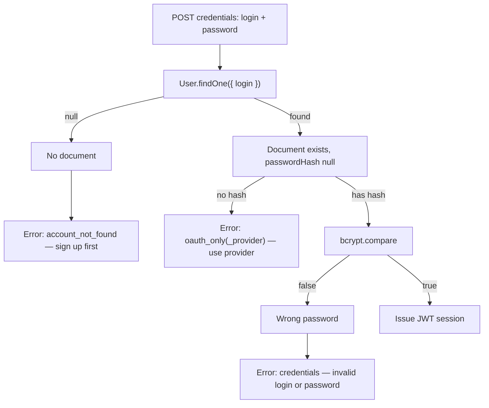

# Sign-In Identity Confusion Matrix

**Status:** `[x] Documented` — credential error discrimination implemented; admin review queues planned.

**Related:** [auth_and_profiles.md](./auth_and_profiles.md), [user_model_and_social_identity.md](./user_model_and_social_identity.md)

---

## Problem

Nexus merges **multiple sign-in methods** into one `users` document. Without explicit UX and server-side discrimination, students encounter confusing failures:

| Situation | Old behaviour | Expected behaviour |
|-----------|---------------|-------------------|
| Login handle never registered | Generic “Invalid login or password” | **Create account first** |
| OAuth-only account (Google/Apple/Telegram) + password attempt | Generic invalid credentials | **Use linked provider** |
| Wrong password on credentials account | Invalid credentials | Invalid credentials (unchanged — avoids enumeration of existence when password path is valid) |
| Email entered in login field | Invalid credentials | Invalid credentials (email is not a credentials handle) |
| OAuth first sign-in creates sparse profile | Redirect to `/profile/settings?onboarding=1` until required fields + consent are saved | Gate enforced in root layout; membership readiness banner still lists gaps on `/profile` |
| Same email, different providers | Merged when `allowDangerousEmailAccountLinking` matches | Single document; link additional providers from `/profile/settings` |

---

## Resolution flow (credentials login)

Implementation:

- `AuthDomain.resolveCredentialsLogin()` — discriminated union (`not_found` · `oauth_only` · `invalid_password` · `success`).
- `src/auth.ts` Credentials `authorize` — throws `AccountNotFoundError` / `OAuthOnlyError` (NextAuth `CredentialsSignin` subclasses).
- `shared/validation/authErrorCodes.ts` — stable user-facing copy.
- `src/lib/credentialsAuthClient.ts` — maps `signIn({ redirect: false }).error` through `getAuthErrorMessage()`.

---

## Provider field harvesting

| Provider | Auto-filled on first sign-in | Signup form prefill (query params) | Notes |
|----------|------------------------------|-------------------------------------|-------|
| Google | `name` → split to `name`/`surname`, `email`, `avatar` | `?name=&surname=&email=` | No phone scope by default |
| Apple | Same as Google | Same | Relay emails supported |
| Telegram widget | `first_name`/`last_name`, `username`, `avatar` | `?name=&surname=` | Phone via bot contact — Phase 4 |
| Credentials signup | All form fields | — | Source of truth for specialty/group/phone at enrolment |

OAuth name splitting: `shared/lib/splitPersonName.ts` used in `AuthDomain.mergeOAuthUser()`.

---

## Signup vs sign-in entry points

| Entry | Creates password? | Creates login handle? | When to use |
|-------|-------------------|----------------------|-------------|
| `/signup` form | Yes | Yes | New students |
| `/login` OAuth row | No | No | Returning users or OAuth-first onboarding |
| `/signup` OAuth row | No | No | Same as login — creates OAuth-only row; student should complete profile in settings |
| Telegram Mini App onboarding | Yes | Yes | In-app first-time registration |

**Rule:** OAuth-first users who need credentials later must set a login + password in `/profile/settings` (future explicit “Add password” flow). Until then, password login must surface `oauth_only`.

---

## Deferred admin panel work

Documented here so implementation is not lost:

### Academic catalog review (`academic_catalog` collection)

- [ ] Admin UI at `/admin/academic-catalog` (planned) — list `status: pending` specialty/group submissions.
- [ ] Approve → `status: approved` (appears in signup dropdowns).
- [ ] Reject → soft-delete or mark rejected; optional notify submitter.
- [ ] Seed approved institution-wide specialties/groups without user submission.

User-submitted values are stored on the user document immediately; pending rows are queued in `AuthDomain.queuePendingAcademicCatalogEntries()`.

### Self-government application queue

- [x] Admin view at `/admin/membership-applications` — list `selfGovernmentApplicationIntent: true` without self-government socium role.
- [x] Approve application → assign `self_government_member` socium role (triggers `qualityScores` init).
- [x] Reject → clear intent flag with audit note.

See [membership_applications.md](./membership_applications.md).

Signup checkbox sets intent only — **does not** grant socium roles until a reviewer approves (or an admin assigns roles manually in User Directory).

### Socium role assignment

- [ ] CRUD on `socium_role_catalog` — custom roles (`assignableBySelf: false` by default).
- [ ] Per-user socium role editor on admin student profile.
- [ ] `Deputy` (group deputy) remains profile-editable but **removed from signup chips** — admin or profile settings only.

---

## Environment pitfalls (still apply)

See [auth_and_profiles.md](./auth_and_profiles.md) — `NEXTAUTH_URL` must match the browser host (LAN phone testing). Identity errors are unrelated to cookie host mismatch; both can occur in the same session.

---

## Acceptance criteria

- [x] Credentials login returns distinct copy for unknown login vs OAuth-only account.
- [x] Signup captures phone, password confirmation, weak-password policy, socium role (Student/Starosta), membership intent, GDPR consent timestamp.
- [x] Specialty/group creatable dropdowns with pending catalog queue.
- [ ] Admin review UI for catalog and membership applications.
- [ ] Explicit “Add password” settings flow for OAuth-only accounts wanting credentials.
