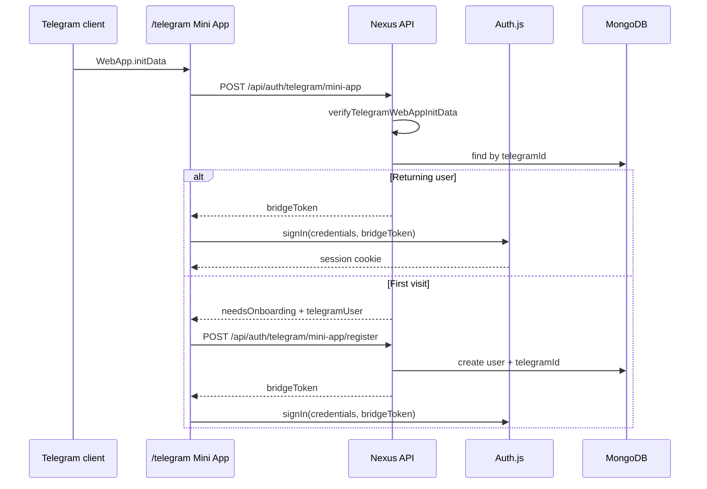

# Telegram Mini App & Bot Authentication

**Status:** `[x] Completed` — Mini App auto-login, onboarding, bot `/start` webhook, and profile unlink implemented. Full group worker commands remain Phase 4.

**Related:** [auth_and_profiles.md](./auth_and_profiles.md), [roadmap.md](../roadmap.md) Phase 2 / Phase 4

---

## Overview

Nexus uses **one Telegram bot** for three surfaces:

| Surface | Purpose | Auth mechanism |
|---------|---------|----------------|
| **Telegram Mini App** (`/telegram`) | Full UI inside Telegram — auto-login for returning users, onboarding for first visit | Signed `initData` HMAC (Web App) |
| **Login Widget** (`/login`, `/signup`) | Browser sign-in / link Telegram on the website | Widget callback HMAC |
| **Bot chat** (`/api/telegram/webhook`) | `/start`, future commands, deep-link into Mini App | `message.from.id` → same `telegramId` in MongoDB |

All paths merge into a single `users` document via `telegramId` (sparse unique index).

`telegram` is a **reserved app route** — Puck cannot publish a CMS page at `/telegram`. If a conflicting page existed in MongoDB, delete it from Page Manager.

---

## User workflows

### First visit (Mini App)

1. User opens bot → taps **Open Nexus** (Web App button) or menu Web App URL.
2. Telegram loads `https://<NEXTAUTH_URL>/telegram` with signed `initData`.
3. Client POSTs `initData` to `/api/auth/telegram/mini-app`.
4. Server verifies HMAC → no `users` row for this `telegramId` → `{ needsOnboarding: true, telegramUser }`.
5. User completes onboarding (login handle, password, optional email, specialty/group).
6. Client POSTs `/api/auth/telegram/mini-app/register` with `initData` + signup fields.
7. Server creates user, links `telegramId`, returns `bridgeToken` → Auth.js session → `/profile`.

### Returning visit (Mini App)

1. Steps 1–3 as above.
2. Server finds user by `telegramId` → updates name/username/avatar sync → `{ bridgeToken }`.
3. Client `signIn("credentials", { bridgeToken })` → `/profile` (no form).

### Browser (unchanged)

- Login Widget on `/login` / `/signup` / profile settings still works for linking Telegram outside the Mini App.

### Change Telegram account

1. User signs in with another method (login/password, Google, Apple).
2. **Profile → Settings → Connected accounts → Unlink Telegram** (`DELETE /api/profile/telegram`).
3. Requires at least one other sign-in method (password or OAuth).
4. Link a different Telegram account via Login Widget or by opening the Mini App while signed in (future: explicit link flow).

### Bot `/start` (no auto web session from chat alone)

- `/start` replies with an inline **Open Nexus** `web_app` button pointing at `/telegram`.
- Chat alone does **not** set a browser/Mini App session; opening the Web App does.

---

## Data flow



---

## Route map

| Route | Type | Purpose |
|-------|------|---------|
| `/telegram` | Page | Mini App entry — auto-auth + onboarding |
| `/api/auth/telegram` | API | Login Widget verify (existing) |
| `/api/auth/telegram/mini-app` | API | POST `initData` → bridge or needsOnboarding |
| `/api/auth/telegram/mini-app/register` | API | POST onboarding + `initData` → create user + bridge |
| `/api/telegram/webhook` | API | Bot updates (`/start`, future commands) |
| `/api/profile/telegram` | API | DELETE — unlink Telegram (session required) |

---

## Environment variables

```bash
TELEGRAM_BOT_TOKEN=              # BotFather token — widget, initData, bot API
NEXT_PUBLIC_TELEGRAM_BOT_USERNAME=
TELEGRAM_WEBHOOK_SECRET=         # Optional — Telegram webhook header validation
# Mini App URL defaults to ${NEXTAUTH_URL}/telegram
```

**Webhook setup (production / tunnel):**

```bash
curl "https://api.telegram.org/bot<TOKEN>/setWebhook?url=<NEXTAUTH_URL>/api/telegram/webhook&secret_token=<TELEGRAM_WEBHOOK_SECRET>"
```

`NEXTAUTH_URL` must be HTTPS and reachable by Telegram (use ngrok or LAN tunnel for local dev).

---

## Code map

| Module | Role |
|--------|------|
| `shared/lib/verifyTelegramWebAppInitData.ts` | Parse + HMAC-verify Mini App `initData` |
| `shared/domains/AuthDomain.ts` | `authenticateTelegramMiniApp`, `registerFromTelegramMiniApp`, `unlinkTelegram` |
| `shared/domains/TelegramBotDomain.ts` | Webhook dispatch, `/start` + Web App button, `sendDirectMessage()` for broadcasts |
| `src/lib/telegramBridge.ts` | Short-lived bridge token for Auth.js Credentials provider |
| `src/components/telegram/TelegramMiniAppEntry.tsx` | Client auto-login + onboarding |
| `src/app/api/telegram/webhook/route.ts` | Telegram Bot API webhook |

---

## AuthDomain API (Telegram)

| Method | Purpose |
|--------|---------|
| `authenticateTelegramMiniApp(initData)` | Verify initData; returning user → bridge payload; else onboarding |
| `registerFromTelegramMiniApp(initData, signup)` | First-time Mini App registration + link |
| `verifyTelegramLoginWidget(payload, botToken)` | Existing widget flow |
| `unlinkTelegram(userId)` | Remove `telegramId` when another auth method exists |

---

## Acceptance criteria

- [x] Mini App route `/telegram` loads inside Telegram WebView
- [x] Returning `telegramId` users auto-sign-in without form
- [x] First-time users complete onboarding (login + password + optional fields)
- [x] `initData` verified server-side (never trust client-only)
- [x] Bot `/start` sends Web App open button
- [x] Profile settings can unlink Telegram when password or OAuth remains
- [x] Login Widget path unchanged for browser linking
- [ ] Bot group commands (`/status`, `/task_done`) — Phase 4
- [ ] Phone harvest on bot contact — roadmap `[~]` bot harvesting

---

## Security notes

- `initData` and widget payloads must be verified with `TELEGRAM_BOT_TOKEN` on every request.
- Reject stale `auth_date` (24h window, same as widget).
- `telegramId` is unique — one Nexus user per Telegram account.
- Unlink requires alternate credentials to prevent account lockout.
