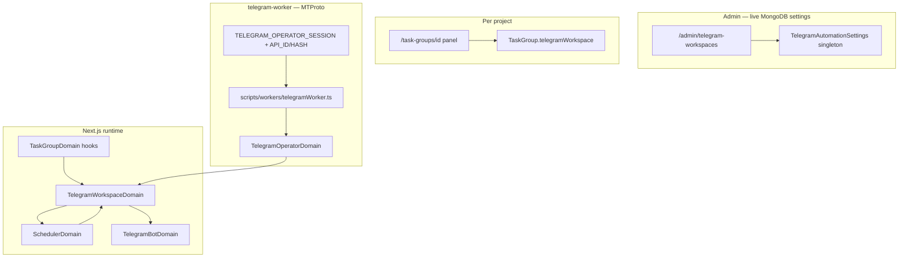

# Telegram project workspaces (ephemeral groups)

**Status:** `[~] In Progress` — operator auto-provision, maintenance jobs, bot task commands (DM + linked groups), and forum topics per task shipped.

**Related:** [task_groups.md](./task_groups.md), [telegram_mini_app_and_bot.md](./telegram_mini_app_and_bot.md), [scheduled_events.md](./scheduled_events.md), [hosting_and_deployment.md](./hosting_and_deployment.md), [roadmap.md](../roadmap.md) Phase 4

---

## Problem

Multi-part **task group projects** benefit from a dedicated Telegram group for coordination. The Telegram **Bot API cannot create groups or enable forum topics** — a real user account (operator MTProto session) must create the chat, toggle Topics, invite members, and promote the bot.

Nexus splits responsibilities:

| Capability | Bot API (`TelegramBotDomain`) | Operator MTProto (`TelegramOperatorDomain`) |
|------------|------------------------------|---------------------------------------------|
| Create supergroup | ✗ | ✓ `channels.CreateChannel` |
| Enable forum topics | ✗ | ✓ `channels.ToggleForum` |
| Invite performers | Limited | ✓ `channels.InviteToChannel` |
| Promote bot admin | ✗ | ✓ `channels.EditAdmin` (+ `manageTopics`) |
| Post in main chat / topics | ✓ | ✗ (bot posts after setup) |
| `/link`, `/tasks`, `/task_report`, `/see_report`, `/completed` | ✓ | ✗ |
| Delete / leave group on complete | `leaveChat` only | ✓ `DeleteChannel` / `LeaveChannel` |

---

## Architecture



**Scheduler** (`telegram_workspace_provision` / `dismantle`) runs in the web process and transitions MongoDB state. **Operator jobs** (`operatorPendingAction` on the workspace subdocument) are polled by `telegram-worker` and execute GramJS calls.

---

## Provisioning strategies

| Strategy | Stored on | Behavior |
|----------|-----------|----------|
| `inherit` | Project | Use institution `defaultStrategy` from admin settings |
| `auto` | Project / default | **`user_session` when operator env is complete**, else `manual_link` |
| `manual_link` | Project / default | Author links existing group via `/link` — operator maintenance still runs when env is set |
| `user_session` | Project / default | Operator worker creates megagroup (primary path) |
| `disabled` | Project / default | No Telegram workspace |

Default institution strategy is **`auto`** — deploy `telegram-worker` with operator credentials so projects never require manual group creation.

---

## Operator account (institutional sacrificed user)

| Item | Location | Notes |
|------|----------|-------|
| Session string | `TELEGRAM_OPERATOR_SESSION` env | GramJS export — **never** in MongoDB |
| API credentials | `TELEGRAM_API_ID`, `TELEGRAM_API_HASH` | From [my.telegram.org](https://my.telegram.org) |
| Bot token | `TELEGRAM_BOT_TOKEN` | Same bot as web — promoted inside created groups |
| Worker | `npm run worker:telegram` or `npm run docker:up` (included in default stack) | Provisioning + maintenance poll loop |
| Fallback | Automatic | Without full worker env, `auto` → `manual_link` |

**Security:** Use a dedicated institutional Telegram account. Rotate session by updating env and restarting the worker.

### Operator maintenance jobs (`operatorPendingAction`)

| Action | When queued | What the worker does |
|--------|-------------|----------------------|
| `enable_forum` | After operator create if Topics toggle failed; after `/link` when forum is off; before task topic sync | Join via invite if needed → `ToggleForum` → bot creates per-task topics |
| `sync_members` | Roster/performer growth on active workspace; after forum enabled on manual link | Invite new Telegram users from roster + child tasks |
| `dismantle` | Project complete/cancel when operator env is set | `DeleteChannel` or `LeaveChannel` → workspace `closed` |

---

## Data model

### Singleton: `telegram_automation_settings`

| Field | Purpose |
|-------|---------|
| `enabled` | Master switch |
| `defaultStrategy` | Default for new projects (`auto` recommended) |
| `autoProvisionOnActivate` | Queue job when project → `active` |
| `minPerformersForAutoGroup` | Skip until enough performers on roster + child tasks |
| `createForumTopicPerTask` | Bot opens a forum branch per dispatched task (requires `forumEnabled`) |
| `taskForumTopicWelcomeTemplate` | First message inside each new task topic |
| `dismantleOnComplete` | Queue dismantle on complete/cancel |
| `dismantleAction` | Bot-side: `archive_notice` \| `leave` \| `none` (operator handles group deletion separately) |
| `*Template` fields | Live-editable copy with `{{title}}`, `{{linkToken}}`, `{{taskTitle}}`, `{{taskUrl}}`, etc. |

### Embedded: `task_groups.telegramWorkspace`

| Field | Purpose |
|-------|---------|
| `strategy` | Per-project override (`inherit` default) |
| `state` | `none` → `queued` → `provisioning` / `awaiting_manual_link` / `active` → `dismantling` → `closed` |
| `chatId`, `chatTitle`, `inviteLink` | Linked Telegram supergroup |
| `forumEnabled` | Topics enabled — set by operator or detected via Bot API `getChat` |
| `operatorPendingAction` | Queued MTProto job for telegram-worker |
| `linkToken` | Short token for fallback `/link` command |
| `lastError` | Last provisioning or operator maintenance error |

### Child tasks: `tasks.telegramForumTopicId`

On dispatch, `TaskDomain` → `TelegramWorkspaceDomain.syncTaskForumTopic()`. If `forumEnabled` is false but operator env is ready, Nexus queues `enable_forum` first, then backfills topics when the worker completes.

---

## End-to-end workflows

### Primary: operator auto-provision (recommended)

1. Project activates with enough roster/task performers → scheduler queues `telegram_workspace_provision`.
2. Web sets workspace `state: provisioning`.
3. **telegram-worker** creates megagroup, enables Topics, invites roster + bot, promotes bot.
4. Workspace → `active`, `forumEnabled: true`, welcome posted by bot.
5. Each dispatched child task → bot creates forum topic + welcome template.
6. Roster grows → worker `sync_members` invites new Telegram users.
7. Project completes → bot posts notice (optional) → operator `dismantle` deletes/leaves group.

### Fallback: manual `/link`

1. Operator env missing or `manual_link` strategy → author receives DM with `/link <token>`.
2. Author creates group, adds **Nexus bot** as admin, runs `/link`.
3. If operator env **is** configured: worker queues `enable_forum` (joins via stored invite link) and `sync_members`.
4. For manual groups **without** a public invite link, add the **operator account as admin** so it can enable Topics.

---

## Scheduler events

| Type | Idempotency key | Handler |
|------|-----------------|---------|
| `telegram_workspace_provision` | `telegram_workspace_provision:{groupId}` | `executeProvisionJob()` — sets `provisioning` or `awaiting_manual_link` |
| `telegram_workspace_dismantle` | `telegram_workspace_dismantle:{groupId}` | `executeDismantleJob()` — bot notice/leave; queues operator `dismantle` when env set |

**Triggers:**

- Project created/activated → `syncWorkspaceForGroup`
- Roster/performer changes → re-evaluate threshold + `sync_members`
- Child task dispatched → `syncTaskForumTopic` (or queue `enable_forum`)
- Project completed/cancelled → `queueDismantleForGroup`

---

## API

| Method | Route | Description |
|--------|-------|-------------|
| GET/PATCH | `/api/admin/telegram-workspaces` | Institution automation policy |
| PATCH | `/api/task-groups/[groupId]/telegram-workspace` | Per-project strategy + `requeue` |

---

## UI

| Route | Purpose |
|-------|---------|
| `/admin/telegram-workspaces` | Admin policy + templates + forum-per-task toggle |
| `/admin/hosting` | Hosting mode diagnostics (worker env readiness) |
| `/task-groups/[id]` | Workspace status, forum flag, operator job queue, link token |

---

## Code map

| Module | Role |
|--------|------|
| `shared/constants/telegramWorkspace.ts` | Strategies, states, operator actions |
| `shared/lib/telegramChannelIdLogic.ts` | Bot API ↔ MTProto channel id conversion |
| `shared/lib/telegramWorkspaceLogic.ts` | Strategy resolution, templates |
| `shared/domains/TelegramWorkspaceDomain.ts` | State machine, queue operator jobs, bot topic sync |
| `shared/domains/TelegramOperatorDomain.ts` | MTProto create, forum, invites, dismantle |
| `shared/domains/TelegramBotDomain.ts` | Webhook, forum topic create, group messages |
| `scripts/workers/telegramWorker.ts` | Poll provisioning + `operatorPendingAction` |
| `shared/domains/TaskGroupDomain.ts` | Lifecycle hooks |

---

## Deploy telegram-worker

1. Set `TELEGRAM_OPERATOR_SESSION`, `TELEGRAM_API_ID`, `TELEGRAM_API_HASH`, `TELEGRAM_BOT_TOKEN` on the worker host (see [hosting_and_deployment.md](./hosting_and_deployment.md)).
2. Run `npm run worker:telegram` or `npm run docker:up` / `npm run docker:up:prod`. GitHub/SSM deployment publishes a separate immutable worker ECR image and starts it only when all four operator credentials are present, preventing an unconfigured restart loop.
3. Worker polls every 15s (override with `TELEGRAM_WORKER_POLL_SECONDS`).

---

## Bot task commands (DM + linked groups)

| Command | Where | Purpose |
|---------|-------|---------|
| `/tasks` | DM or linked group | List open parts — group scope uses `telegramWorkspace.chatId`; unlinked groups get `tasksUnlinkedGroupTemplate` |
| `/task_report [n]` | DM or linked group | Start configurable report wizard (`description` / `media` steps) |
| `/see_report [n]` | DM or linked group | Show stored performer report |
| `/completed [n]` | DM or linked group | Mark task completed when `botCompletedCommandEnabled` and actor has dispatch authority |
| `/cancel` | During wizard | Discard in-progress draft |
| `/done` / `/skip` | Media step | Finish collecting attachments or skip optional media |

**Group binding:** Auto-created groups store `chatId` on the project when provisioning completes. Manual groups require `/link <token>`. If the bot was added to a random group without linking, `/tasks` explains how to bind the chat.

**Report drafts:** In-progress `/task_report` data lives in `telegram_bot_sessions` (TTL ~30 min) only. Task documents are updated on successful wizard completion via `TaskDomain.submitReport`. Any other bot command discards the draft first (configurable `taskReportSessionInterruptedTemplate`).

**Proof media:** Tasks carry `reportMediaAllowed` (default `false`). When false, the `media` wizard step is skipped even if listed in institution `reportFlowSteps`.

**Templates:** All message patterns editable live at `/admin/telegram-workspaces` → **Bot task commands** (no redeploy).

---

## Tests

```bash
npm run test:run -- telegram-workspace-logic
npm run test:run -- telegram-channel-id-logic
npm run test:run -- telegram-bot-command-logic
npm run test:run -- telegram-report-flow-logic
npm run test:run -- telegram-bot-task-logic
```

---

## Acceptance criteria

- [x] Admin can change all policies/templates without redeploy
- [x] Per-project strategy override + re-queue
- [x] Operator auto-creates groups with Topics + bot promotion
- [x] Operator maintenance: enable forum, sync members, dismantle
- [x] Manual `/link` binds group; operator completes forum/member setup when env set
- [x] `/tasks`, `/task_report`, `/see_report` in DM and linked groups; configurable templates + report step order
- [x] Optional `/completed` for dispatch admins (`botCompletedCommandEnabled`)
- [x] Forum topic per dispatched task part (bot API after operator enables Topics)
